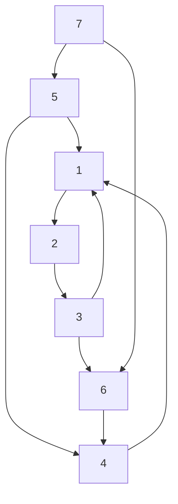

# 2017

## Problem 7

(1) Given an integer $x$, we calculate a polynomial, $f = \sum_{i=0}^{n} a_i x^i \, (n, a_i (0 \leq i \leq n) \text{ are natural numbers})$. A single addition or multiplication of two values takes a unit time regardless of the number of the digits in the representation of the values.

(A) Let $f_i = a_i x^i$. Find the time complexity (with regard to $n$) of an algorithm that calculates $f_0, f_1, \ldots, f_n$ individually and then calculates $f = \sum_{i=0}^{n} f_i$.

(B) Let $$g_i = \begin{cases}

a_n & \text{(when } i = n\text{)} \\

g_{i+1} x + a_i & \text{(when } i < n\text{)}

\end{cases}$$. Notice that $f = g_0$ holds. Find the time complexity (with regard to $n$) of an algorithm that calculates $g_0$, hence $f$ by calculating $g_n, g_{n-1}, \ldots, g_0$ in this order.

(2) Given two $2^{n+1}$-bit integers $a$ and $b$, let $a_{hi}, b_{hi}$ be the highest $2^n$ bits of $a$ and $b$, and $a_{lo}, b_{lo}$ the lowest $2^n$ bits of $a$ and $b$, respectively. We calculate the product of $a$ and $b$ when $n$ is fairly large. Assume that computation time for addition or shift is negligible compared to that for multiplication.

(A) The multiplication of $2^{n+1}$-bit integers can be constructed from the multiplication of $2^n$-bit integers as follows: $ab = r_2 2^{2n} + r_1 2^n + r_0$, where $r_2 = a_{hi} b_{hi}, r_1 = a_{hi} b_{lo} + a_{lo} b_{hi}, r_0 = a_{lo} b_{lo}$. We can recursively apply this reduction until every multiplication only involves integers small enough to fit in the machine word of the computer. Let $T(2^{n+1})$ be the number of machine-word multiplications required in the multiplication of two $2^{n+1}$-bit integers. Express $T(2^{n+1})$ in terms of $T(2^n)$.

(B) Solve the recursive equation you answered in (A), and express $T(2^n)$ in Landau's $O$ notation.

(C) We reduce the number of multiplications in the calculation in (A) by calculating $r_1$ as $r_1 = r_2 + r_0 - (a_{hi} - a_{lo})(b_{hi} - b_{lo})$. Express $T(2^n)$ in Landau's $O$ notation, and prove it.

---

(1) 给定一个整数 $x$，我们计算一个多项式，$f = \sum_{i=0}^{n} a_i x^i \, (n, a_i (0 \leq i \leq n) \text{ 是自然数})$。两个值的单次加法或乘法的计算时间是一个单位时间，与值的表示形式中的位数无关。

(A) 令 $f_i = a_i x^i$。找到一个算法的时间复杂度（关于 $n$），该算法分别计算 $f_0, f_1, \ldots, f_n$，然后计算 $f = \sum_{i=0}^{n} f_i$。

(B) 令 $$g_i = \begin{cases}

a_n & \text{(当 } i = n\text{ 时)} \\

g_{i+1} x + a_i & \text{(当 } i < n\text{ 时)}

\end{cases}$$

。注意 $f = g_0$ 成立。找到一个算法的时间复杂度（关于 $n$），该算法计算 $g_0$，从而通过依次计算 $g_n, g_{n-1}, \ldots, g_0$ 得到 $f$。

(2) 给定两个 $2^{n+1}$ 位的整数 $a$ 和 $b$，令 $a_{hi}, b_{hi}$ 为 $a$ 和 $b$ 的最高 $2^n$ 位，$a_{lo}, b_{lo}$ 为 $a$ 和 $b$ 的最低 $2^n$ 位。我们在 $n$ 较大时计算 $a$ 和 $b$ 的乘积。假设加法或移位的计算时间相对于乘法可以忽略不计。

(A) $2^{n+1}$ 位整数的乘法可以通过 $2^n$ 位整数的乘法构造，如下所示：$ab = r_2 2^{2n} + r_1 2^n + r_0$，其中 $r_2 = a_{hi} b_{hi}, r_1 = a_{hi} b_{lo} + a_{lo} b_{hi}, r_0 = a_{lo} b_{lo}$。我们可以递归地应用这种缩减，直到每次乘法仅涉及足够小的整数以适应计算机的机器字。设 $T(2^{n+1})$ 为两个 $2^{n+1}$ 位整数相乘所需的机器字乘法次数。用 $T(2^n)$ 表示 $T(2^{n+1})$。

(B) 解答你在 (A) 中回答的递归方程，并用 Landau 符号 $O$ 表示 $T(2^n)$。

(C) 我们通过计算 $r_1$ 为 $r_1 = r_2 + r_0 - (a_{hi} - a_{lo})(b_{hi} - b_{lo})$ 来减少 (A) 中的乘法次数。用 Landau 符号 $O$ 表示 $T(2^n)$，并证明它。

---

## Problem 8

Answer the following questions about linear algebra.

(1) Denote by $\mathbf{o}$ the zero vector. Let $\mathbf{a}$ denote a two-dimensional vector that is not $\mathbf{o}$. $T_{\mathbf{a}}(\mathbf{x})$ is the orthogonal projection of a point $\mathbf{x}$ on $\mathbf{a}$. Prove the following propositions.

  (1.1) $T_{\mathbf{a}}(T_{\mathbf{a}}(\mathbf{x})) = T_{\mathbf{a}}(\mathbf{x})$ for any two-dimensional point $\mathbf{x}$.

  (1.2) $T_{\mathbf{b}}(T_{\mathbf{a}}(\mathbf{x})) = \mathbf{o}$ for any non-zero two-dimensional vector $\mathbf{b}$ orthogonal to $\mathbf{a}$.

(2) Assume that a real symmetric matrix $\mathbf{P}$ satisfies $\mathbf{P}^2 = \mathbf{P}$. Prove that the eigenvalues of $\mathbf{P}$ are either 0 or 1.

(3) Denote by $\mathbf{a_1}, \mathbf{a_2}$ the column vectors corresponding to the bases of a two-dimensional subspace of the three dimensional space. Describe the projection matrix to the subspace using $\mathbf{A} = [\mathbf{a_1}, \mathbf{a_2}]$.

---

回答以下有关线性代数的问题。

(1) 用 $\mathbf{o}$ 表示零向量。设 $\mathbf{a}$ 表示一个二维向量，它不是 $\mathbf{o}$。$T_{\mathbf{a}}(\mathbf{x})$ 是点 $\mathbf{x}$ 在 $\mathbf{a}$ 上的正交投影。证明以下命题。

  (1.1) 对于任意二维点 $\mathbf{x}$，$T_{\mathbf{a}}(T_{\mathbf{a}}(\mathbf{x})) = T_{\mathbf{a}}(\mathbf{x})$。

  (1.2) 对于任意非零二维向量 $\mathbf{b}$，它与 $\mathbf{a}$ 正交，$T_{\mathbf{b}}(T_{\mathbf{a}}(\mathbf{x})) = \mathbf{o}$。

(2) 假设一个实对称矩阵 $\mathbf{P}$ 满足 $\mathbf{P}^2 = \mathbf{P}$。证明 $\mathbf{P}$ 的特征值要么是 0，要么是 1。

(3) 用 $\mathbf{a_1}, \mathbf{a_2}$ 表示对应于三维空间的二维子空间基的列向量。用 $\mathbf{A} = [\mathbf{a_1}, \mathbf{a_2}]$ 描述该子空间的投影矩阵。

---

## Problem 9

Suppose that $\mathbf{M}$ is an array with $n (\geq 1)$ distinct integers. The quicksort algorithm for sorting $\mathbf{M}$ in the ascending order has the following three steps.

A) Select and remove an element $x$ from $\mathbf{M}$. Call $x$ a pivot.

B) Divide $\mathbf{M}$ into arrays $\mathbf{M_1}$ and $\mathbf{M_2}$ such that $y \leq x$ for $y \in \mathbf{M_1}$ and $x \leq z$ for $z \in \mathbf{M_2}$.

C) Sort $\mathbf{M_1}$ and $\mathbf{M_2}$ in the ascending order using quicksort, and return the concatenation of $\mathbf{M_1}$, $x$, and $\mathbf{M_2}$.

Answer the following questions.

1. How would you implement Step B in quicksort?

2. In Step A, if we always set the first element in $\mathbf{M}$ to pivot $x$, show an input array that the algorithm sorts in $O(n^2)$ worst-case time, and prove this property.

3. In Step A, if we select a position in $\mathbf{M}$ at random and set the element at the position to pivot $x$, prove that the expected time complexity is $O(n \log n)$ for an arbitrary input array.

4. Design an algorithm that calculates the $k$-th smallest element in $\mathbf{M}$ in $O(n)$ expected time, and prove this property.

---

假设 $\mathbf{M}$ 是一个包含 $n (\geq 1)$ 个不同整数的数组。用于升序排列 $\mathbf{M}$ 的快速排序算法有以下三个步骤。

A) 从 $\mathbf{M}$ 中选择并移除一个元素 $x$。称 $x$ 为枢轴。

B) 将 $\mathbf{M}$ 分成数组 $\mathbf{M_1}$ 和 $\mathbf{M_2}$，使得 $y \leq x$ 对于所有 $y \in \mathbf{M_1}$，并且 $x \leq z$ 对于所有 $z \in \mathbf{M_2}$。

C) 使用快速排序按升序排列 $\mathbf{M_1}$ 和 $\mathbf{M_2}$，并返回 $\mathbf{M_1}$，$x$ 和 $\mathbf{M_2}$ 的连接。

回答以下问题。

1. 你将如何在快速排序中实现步骤 B？

2. 在步骤 A 中，如果我们总是将 $\mathbf{M}$ 的第一个元素设置为枢轴 $x$，展示一个输入数组，使算法在 $O(n^2)$ 最坏情况下进行排序，并证明这一性质。

3. 在步骤 A 中，如果我们在 $\mathbf{M}$ 中随机选择一个位置并将该位置的元素设置为枢轴 $x$，证明对于任意输入数组，预期时间复杂度为 $O(n \log n)$。

4. 设计一个算法，在 $O(n)$ 预期时间内计算 $\mathbf{M}$ 中的第 $k$ 小元素，并证明这一性质。

---

## Problem 10

We define the shortest distance from a vertex $i$ to a vertex $j$ on a graph as the number of edges in a path from $i$ to $j$ that contains the smallest number of edges, except that the shortest distance is $+\infty$ when no such path exists and that it is $0$ when $i$ and $j$ are identical.

(1) Let us consider the directed graph shown below.

(A) Show the adjacency matrix.

(B) Show a matrix $\mathbf{S}$, whose element $s_{i,j}$ is the shortest distance from a vertex $i$ to a vertex $j$.

(2) Suppose we are given a simple directed graph $G = (V, E)$, where the vertex set $V = \{1, 2, \ldots, n\}$ and $E$ is the edge set. $E$ is represented by a matrix $\mathbf{D^{(0)}} = (d_{i,j}^{(0)})$, where

$$

d_{i,j}^{(0)} = \begin{cases} 

0 & \text{(if } i = j \text{)} \\

1 & \text{(if an edge } i \to j \text{ exists)} \\

+\infty & \text{(otherwise)}

\end{cases}

$$

(A) Let $\mathbf{V_{i,j}^{(k)}} = \{1, 2, \ldots, k\} \cup \{i, j\}$. Let $\mathbf{E_{i,j}^{(k)}}$ be the set of edges in $E$ that start from and end at a vertex in $\mathbf{V_{i,j}^{(k)}}$. Let $d_{i,j}^{(k)}$ be the shortest distance from a vertex $i$ to a vertex $j$ on a directed graph $G_{i,j}^{(k)} = (\mathbf{V_{i,j}^{(k)}}, \mathbf{E_{i,j}^{(k)}})$, and let $\mathbf{D^{(k)}} = (d_{i,j}^{(k)})$. Express $\mathbf{D^{(1)}}$ in terms of $\mathbf{D^{(0)}}$.

(B) $\mathbf{D^{(k+1)}}$ can be computed from $\mathbf{D^{(k)}}$ as follows. Fill in the two blanks.

$$

d_{i,j}^{(k+1)} = \min \left( d_{i,j}^{(k)}, \boxed{\phantom{ddd}} + \boxed{\phantom{ddd}} \right)

$$

(C) Given $G$, show an algorithm to compute the all-pair shortest distances, and find its time complexity with regard to $n$.

---

我们将从顶点 $i$ 到顶点 $j$ 的最短距离定义为图中从 $i$ 到 $j$ 的包含最少边数的路径中的边数，除了当不存在这样的路径时最短距离为 $+\infty$，以及当 $i$ 和 $j$ 相同时为 $0$。

(1) 让我们考虑下图所示的有向图。

(A) 显示邻接矩阵。

(B) 显示一个矩阵 $\mathbf{S}$，其元素 $s_{i,j}$ 是从顶点 $i$ 到顶点 $j$ 的最短距离。

(2) 假设我们有一个简单的有向图 $G = (V, E)$，其中顶点集 $V = \{1, 2, \ldots, n\}$ 和边集 $E$。$E$ 由矩阵 $\mathbf{D^{(0)}} = (d_{i,j}^{(0)})$ 表示，其中

$$

d_{i,j}^{(0)} = \begin{cases} 

0 & \text{（如果 } i = j \text{）} \\

1 & \text{（如果存在边 } i \to j \text{）} \\

+\infty & \text{（否则）}

\end{cases}

$$

(A) 设 $\mathbf{V_{i,j}^{(k)}} = \{1, 2, \ldots, k\} \cup \{i, j\}$。设 $\mathbf{E_{i,j}^{(k)}}$ 为从顶点 $\mathbf{V_{i,j}^{(k)}}$ 中的顶点出发并结束于顶点的边集。设 $d_{i,j}^{(k)}$ 为有向图 $G_{i,j}^{(k)} = (\mathbf{V_{i,j}^{(k)}}, \mathbf{E_{i,j}^{(k)}})$ 上从顶点 $i$ 到顶点 $j$ 的最短距离，并设 $\mathbf{D^{(k)}} = (d_{i,j}^{(k)})$。用 $\mathbf{D^{(0)}}$ 表示 $\mathbf{D^{(1)}}$。

(B) $\mathbf{D^{(k+1)}}$ 可以从 $\mathbf{D^{(k)}}$ 计算如下。填写两个空格。

$$

d_{i,j}^{(k+1)} = \min \left( d_{i,j}^{(k)}, \boxed{\phantom{ddd}} + \boxed{\phantom{ddd}} \right)

$$

(C) 给定 $G$，展示一个算法来计算所有对的最短距离，并找到其关于 $n$ 的时间复杂度。

---

## Problem 11

Let $\mathbf{S} = \{V_1, V_2, V_3, \ldots\}$ be a sequence of mutually independent random variables such that each $V_i$ takes the value of 1 with probability $p$, and 0 with probability $(1 - p)$ ($0 < p < 1$). We define a sequence $X_i$ ($i = 0, 1, 2, \ldots$) as follows:

$$

X_0 = 1

$$

$$

X_i = aX_{i-1} + V_i, \ (i \geq 1)

$$

Here, $a$ is a positive real number. Answer the following questions.

1. Find the expected value $\mathbb{E}(X_1)$ of $X_1$.

2. Find the variance $\mathrm{Var}(X_1) = \mathbb{E}(X_1^2) - (\mathbb{E}(X_1))^2$ of $X_1$.

3. Express $X_i$ as a function of $a$ and the elements of $\mathbf{S}$ ($i \geq 1$).

4. Find $\mathbb{E}(X_i)$ ($i \geq 1$).

5. Find $x_\infty = \lim_{i \to \infty} \mathbb{E}(X_i)$ as a function of $a$ and $p$.

---

设 $\mathbf{S} = \{V_1, V_2, V_3, \ldots\}$ 为一组相互独立的随机变量，使得每个 $V_i$ 以概率 $p$ 取值为 1， 以概率 $(1 - p)$ 取值为 0（$0 < p < 1$）。我们定义一个序列 $X_i$ （$i = 0, 1, 2, \ldots$）如下：

$$

X_0 = 1

$$

$$

X_i = aX_{i-1} + V_i, \ (i \geq 1)

$$

其中，$a$ 是一个正实数。回答以下问题。

1. 求 $X_1$ 的期望值 $\mathbb{E}(X_1)$。

2. 求 $X_1$ 的方差 $\mathrm{Var}(X_1) = \mathbb{E}(X_1^2) - (\mathbb{E}(X_1))^2$。

3. 表示 $X_i$ 作为 $a$ 和 $\mathbf{S}$ 元素的函数（$i \geq 1$）。

4. 求 $\mathbb{E}(X_i)$（$i \geq 1$）。

5. 求 $x_\infty = \lim_{i \to \infty} \mathbb{E}(X_i)$，作为 $a$ 和 $p$ 的函数。

---

## Problem 12

Consider an algorithm that calculates a longest palindrome that is a substring of a given string $x = x_1 \ldots x_m$.

Here, we define a string $y = y_1 \ldots y_n$ to be a palindrome if for any $j$ $(1 \leq j \leq n)$ $y_j = y_{n+1-j}$.

Any string of one character is a palindrome and a string of two characters $y_1 y_2$ is a palindrome if and only if $y_1 = y_2$.

Answer the following questions.

1. When $x_i \ldots x_j$ is a palindrome, show the condition that is necessary and sufficient for $x_{i-1} \ldots x_{j+1}$ to be a palindrome.

2. Variable $R(i, j)$ $(1 \leq i \leq m, 1 \leq j \leq m)$ is 1 if $x_i \ldots x_j$ is a palindrome, otherwise 0. Show the formula for each of the blanks, $\text{A}$, $\text{B}$ and $\text{C}$, in the following iterative equation. $\delta(a, b)$ is 1 if $a = b$, otherwise 0.

$$

R(i-1, \text{A}) = \delta(\text{B}, x_{j+1}) R(\text{C}, j)

$$

3. Show all the initial values of $R(i, j)$ and the procedure of the iterations for calculating $R(i, j)$ $(1 \leq i \leq m, 1 \leq j \leq m)$ by dynamic programming using the above iterative equation.

4. Explain how to get a longest palindrome that is a substring of $x = x_1 \ldots x_m$ using $R(i, j)$ $(1 \leq i \leq m, 1 \leq j \leq m)$.

---

考虑一种算法来计算给定字符串 $x = x_1 \ldots x_m$ 的最长回文子串。

这里，我们定义一个字符串 $y = y_1 \ldots y_n$ 为回文串，如果对于任意 $j$ $(1 \leq j \leq n)$，$y_j = y_{n+1-j}$。

任何一个字符的字符串都是回文串，任何两个字符的字符串 $y_1 y_2$ 是回文串当且仅当 $y_1 = y_2$。

回答以下问题。

1. 当 $x_i \ldots x_j$ 是回文串时，证明 $x_{i-1} \ldots x_{j+1}$ 成为回文串的充要条件。

2. 变量 $R(i, j)$ $(1 \leq i \leq m, 1 \leq j \leq m)$ 若 $x_i \ldots x_j$ 是回文串则为 1，否则为 0。展示以下迭代方程中每个空白的公式，$\text{A}$, $\text{B}$ 和 $\text{C}$。 $\delta(a, b)$ 当 $a = b$ 时为 1，否则为 0。

$$

R(i-1, \text{A}) = \delta(\text{B}, x_{j+1}) R(\text{C}, j)

$$

3. 通过使用上述迭代方程，展示所有 $R(i, j)$ 的初始值和通过动态规划计算 $R(i, j)$ $(1 \leq i \leq m, 1 \leq j \leq m)$ 的迭代过程。

4. 解释如何使用 $R(i, j)$ $(1 \leq i \leq m, 1 \leq j \leq m)$ 获取 $x = x_1 \ldots x_m$ 的最长回文子串。
