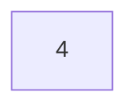
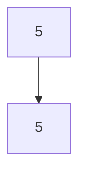
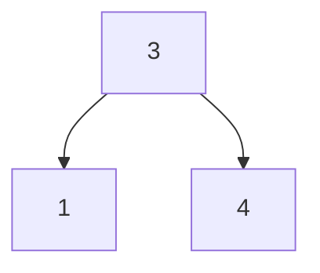
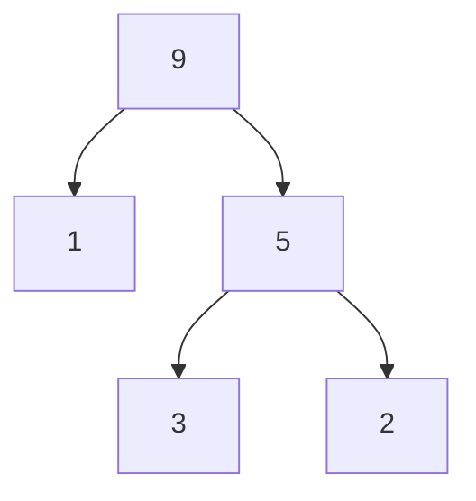
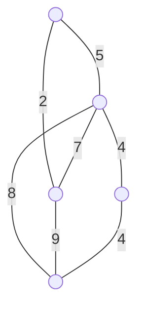

# 2018

## Question 7

Let $n$ be a positive integer. Let $f(n)$ and $g(n)$ denote functions that represent computation time for solving a problem of size $n$. To provide asymptotic upper and lower bounds on $f(n)$, we define the following sets of functions, $O(g(n))$ and $\Omega(g(n))$, respectively:

- $O(g(n)) = \{f(n) \mid \text{There exist positive constants } c_0 \text{ and } n_0 \text{ such that } 0 \leq f(n) \leq c_0 \, g(n) \text{ for all } n \geq n_0\}$
- $\Omega(g(n)) = \{f(n) \mid \text{There exist positive constants } c_0 \text{ and } n_0 \text{ such that } 0 \leq c_0 \, g(n) \leq f(n) \text{ for all } n \geq n_0\}$

Answer the following questions.

1. Let $f(n) = 2^{2n}$. Prove whether $f(n)$ is in $O(2^n)$, and whether $f(n)$ is in $\Omega(2^n)$.
2. Let $f(n) = \sum_{i=1}^{n}(1/i)$. Prove whether $f(n)$ is in $O(\log n)$, and whether $f(n)$ is in $\Omega(\log n)$.
3. Let $\lfloor x \rfloor$ be the largest integer that is equal to or smaller than real number $x$. Suppose that $f(n)$ satisfies that $f(1) = 1$ and $f(n) = f(\lfloor n/2 \rfloor) + n$ for $n \geq 2$. Prove whether $f(n)$ is in $O(n)$, and whether $f(n)$ is in $\Omega(n^2)$.

---

设 $n$ 为正整数。令 $f(n)$ 和 $g(n)$ 表示解决大小为 $n$ 的问题的计算时间函数。为了提供 $f(n)$ 的渐近上界和下界，我们分别定义了以下函数集 $O(g(n))$ 和 $\Omega(g(n))$：

- $O(g(n)) = \{f(n) \mid \text{存在正常数 } c_0 \text{ 和 } n_0 \text{ 使得 } 0 \leq f(n) \leq c_0 \, g(n) \text{ 对于所有 } n \geq n_0\}$
- $\Omega(g(n)) = \{f(n) \mid \text{存在正常数 } c_0 \text{ 和 } n_0 \text{ 使得 } 0 \leq c_0 \, g(n) \leq f(n) \text{ 对于所有 } n \geq n_0\}$

回答下列问题。

1. 令 $f(n) = 2^{2n}$。证明 $f(n)$ 是否在 $O(2^n)$ 中，以及 $f(n)$ 是否在 $\Omega(2^n)$ 中。
2. 令 $f(n) = \sum_{i=1}^{n}(1/i)$。证明 $f(n)$ 是否在 $O(\log n)$ 中，以及 $f(n)$ 是否在 $\Omega(\log n)$ 中。
3. 设 $\lfloor x \rfloor$ 为等于或小于实数 $x$ 的最大整数。假设 $f(n)$ 满足 $f(1) = 1$ 且 $f(n) = f(\lfloor n/2 \rfloor) + n$ 对于 $n \geq 2$。证明 $f(n)$ 是否在 $O(n)$ 中，以及 $f(n)$ 是否在 $\Omega(n^2)$ 中。

---

## Question 8

Let $\mathbf{A}$ be an $n \times m$ real matrix with positive rank $r$. Such a matrix has a singular value decomposition $\mathbf{A} = \mathbf{U} \mathbf{\Sigma} \mathbf{V}^T$, where $\mathbf{U}$ and $\mathbf{V}$ are $n \times r$, $m \times r$ real matrices, respectively, and satisfy $\mathbf{U}^T \mathbf{U} = \mathbf{I}_r$, $\mathbf{V}^T \mathbf{V} = \mathbf{I}_r$ ($\mathbf{I}_d$: $d \times d$ unit matrix, $\mathbf{M}^T$: transpose of matrix $\mathbf{M}$). $\mathbf{\Sigma}$ is an $r \times r$ real diagonal matrix whose diagonal elements $\Sigma_{kk} = \sigma_k$ ($k = 1, \ldots, r$) satisfy $\sigma_1 \geq \cdots \geq \sigma_r > 0$.

1. Describe all the positive eigenvalues and associated normalized eigenvectors of matrix $\mathbf{A}^T \mathbf{A}$.
2. Let $T_{\mathbf{A}}: \mathbb{R}^m \to \mathbb{R}^n$ be a linear mapping defined by $T_{\mathbf{A}} (\mathbf{x}) = \mathbf{A} \mathbf{x}$. Describe the conditions on $n, m, r$ such that $T_{\mathbf{A}}$ is surjective. Also, describe the conditions on $n, m, r$ such that $T_{\mathbf{A}}$ is injective.
3. The pseudoinverse of $\mathbf{A}$ is defined by $\mathbf{A}^+ = \mathbf{V} \mathbf{\Sigma}^{-1} \mathbf{U}^T$. Let $\mathbf{B} = (\mathbf{I}_m - \mathbf{A}^+ \mathbf{A})$ and define linear mapping $T_{\mathbf{B}}: \mathbb{R}^m \to \mathbb{R}^m$ by $T_{\mathbf{B}} (\mathbf{x}) = \mathbf{B} \mathbf{x}$. Show that image $\mathrm{Im}(T_{\mathbf{B}}) = \{\mathbf{B} \mathbf{x} \mid \mathbf{x} \in \mathbb{R}^m\}$ is linearly isomorphic to kernel $\mathrm{Ker}(T_{\mathbf{A}}) = \{\mathbf{x} \in \mathbb{R}^m \mid \mathbf{A} \mathbf{x} = \mathbf{0}_d\}$ ($\mathbf{0}_d$: $d$ dimensional zero vector).
4. Show that $\mathbf{x} = \mathbf{x}_1 + \mathbf{x}_2$ ($\mathbf{x}_1 = \mathbf{B} \mathbf{x}$, $\mathbf{x}_2 = (\mathbf{x} - \mathbf{x}_1)$) is an orthogonal decomposition.
5. For a given $\mathbf{b} \in \mathbb{R}^n$, let $\mathbf{x}_0 = \mathbf{A}^+ \mathbf{b} \in \mathbb{R}^m$. Show that $\mathbf{x} = \mathbf{x}_0$ minimizes $(\mathbf{A} \mathbf{x} - \mathbf{b})^T (\mathbf{A} \mathbf{x} - \mathbf{b})$.
   (Hint: $\mathbf{A} \mathbf{x} - \mathbf{b} = \mathbf{A} (\mathbf{x} - \mathbf{x}_0) + (\mathbf{A} \mathbf{x}_0 - \mathbf{b})$)

---

设 $\mathbf{A}$ 为一个 $n \times m$ 的实矩阵，且正秩为 $r$。这样的矩阵有一个奇异值分解 $\mathbf{A} = \mathbf{U} \mathbf{\Sigma} \mathbf{V}^T$，其中 $\mathbf{U}$ 和 $\mathbf{V}$ 分别是 $n \times r$、$m \times r$ 的实矩阵，并且满足 $\mathbf{U}^T \mathbf{U} = \mathbf{I}_r$，$\mathbf{V}^T \mathbf{V} = \mathbf{I}_r$（$\mathbf{I}_d$：$d \times d$ 单位矩阵，$\mathbf{M}^T$：矩阵 $\mathbf{M}$ 的转置）。$\mathbf{\Sigma}$ 是一个 $r \times r$ 的实对角矩阵，其对角元素 $\Sigma_{kk} = \sigma_k$（$k = 1, \ldots, r$）满足 $\sigma_1 \geq \cdots \geq \sigma_r > 0$。

1. 描述矩阵 $\mathbf{A}^T \mathbf{A}$ 的所有正特征值和相关的归一化特征向量。
2. 令 $T_{\mathbf{A}}: \mathbb{R}^m \to \mathbb{R}^n$ 为由 $T_{\mathbf{A}} (\mathbf{x}) = \mathbf{A} \mathbf{x}$ 定义的线性映射。描述 $n, m, r$ 的条件，使得 $T_{\mathbf{A}}$ 是满射。同时，描述 $n, m, r$ 的条件，使得 $T_{\mathbf{A}}$ 是单射。
3. $\mathbf{A}$ 的伪逆定义为 $\mathbf{A}^+ = \mathbf{V} \mathbf{\Sigma}^{-1} \mathbf{U}^T$。令 $\mathbf{B} = (\mathbf{I}_m - \mathbf{A}^+ \mathbf{A})$ 并定义线性映射 $T_{\mathbf{B}}: \mathbb{R}^m \to \mathbb{R}^m$ 由 $T_{\mathbf{B}} (\mathbf{x}) = \mathbf{B} \mathbf{x}$。证明 $\mathrm{Im}(T_{\mathbf{B}}) = \{\mathbf{B} \mathbf{x} \mid \mathbf{x} \in \mathbb{R}^m\}$ 在线性上同构于 $\mathrm{Ker}(T_{\mathbf{A}}) = \{\mathbf{x} \in \mathbb{R}^m \mid \mathbf{A} \mathbf{x} = \mathbf{0}_d\}$（$\mathbf{0}_d$：$d$ 维零向量）。
4. 证明 $\mathbf{x} = \mathbf{x}_1 + \mathbf{x}_2$（$\mathbf{x}_1 = \mathbf{B} \mathbf{x}$，$\mathbf{x}_2 = (\mathbf{x} - \mathbf{x}_1)$）是一个正交分解。
5. 对于给定的 $\mathbf{b} \in \mathbb{R}^n$，令 $\mathbf{x}_0 = \mathbf{A}^+ \mathbf{b} \in \mathbb{R}^m$。证明 $\mathbf{x} = \mathbf{x}_0$ 最小化 $(\mathbf{A} \mathbf{x} - \mathbf{b})^T (\mathbf{A} \mathbf{x} - \mathbf{b})$。
   （提示：$\mathbf{A} \mathbf{x} - \mathbf{b} = \mathbf{A} (\mathbf{x} - \mathbf{x}_0) + (\mathbf{A} \mathbf{x}_0 - \mathbf{b})$）

---

## Question 9

A binary heap tree is a binary tree with integer labels such that the value of a parent node is no less than the value of any child node. We denote the height of a tree $\mathbf{T}$ by $h(\mathbf{T})$.

1. Choose all binary heap trees from the following.

- (A)

- (B)

- (C)

- (D)

2. Suppose we have a binary tree $\mathbf{T}$ of height 2. Show an algorithm that makes $\mathbf{T}$ a binary heap tree by exchanging the labels of a node and its child at most once.

3. Suppose we have two binary heap trees $\mathbf{T_1}$ and $\mathbf{T_2}$. A tree $\mathbf{T}$ has a root node $\mathbf{r}$ concatenated with $\mathbf{T_1}$ and $\mathbf{T_2}$; the root nodes of $\mathbf{T_1}$ and $\mathbf{T_2}$ become the two children of $\mathbf{r}$. Show an algorithm that creates a binary heap tree $\mathbf{T'}$ from a tree $\mathbf{T}$ in worst-case time complexity $O(\max(h(\mathbf{T_1}), h(\mathbf{T_2})))$.

4. Suppose we have a binary tree $\mathbf{T}$. Show an algorithm that makes $\mathbf{T}$ a binary heap tree by iteratively exchanging the labels of a node and its child in worst-case time complexity $O(2^{h(\mathbf{T})})$.

5. Show an algorithm that sorts in descending order an array of integers using the operations you showed in (4). Show the worst-case time complexity of the algorithm with regard to the number of elements in the array.

---

二叉堆树是一种二叉树，其整数标签的值满足父节点的值不小于任何子节点的值。我们用 $h(\mathbf{T})$ 表示树 $\mathbf{T}$ 的高度。

1. 从以下选项中选择所有二叉堆树。
   - (A)

   - (B)

   - (C)

   - (D)

2. 假设我们有一个高度为 2 的二叉树 $\mathbf{T}$。展示一个算法，通过至多一次交换一个节点和其子节点的标签使 $\mathbf{T}$ 成为一个二叉堆树。

3. 假设我们有两个二叉堆树 $\mathbf{T_1}$ 和 $\mathbf{T_2}$。一个树 $\mathbf{T}$ 有一个根节点 $\mathbf{r}$，连接了 $\mathbf{T_1}$ 和 $\mathbf{T_2}$；$\mathbf{T_1}$ 和 $\mathbf{T_2}$ 的根节点成为 $\mathbf{r}$ 的两个子节点。展示一个算法，使得从树 $\mathbf{T}$ 创建一个二叉堆树 $\mathbf{T'}$ 的最坏时间复杂度为 $O(\max(h(\mathbf{T_1}), h(\mathbf{T_2})))$。

4. 假设我们有一个二叉树 $\mathbf{T}$。展示一个算法，通过迭代交换一个节点和其子节点的标签使 $\mathbf{T}$ 成为一个二叉堆树，其最坏时间复杂度为 $O(2^{h(\mathbf{T})})$。

5. 展示一个算法，使用你在 (4) 中展示的操作按降序排列整数数组。展示该算法相对于数组中元素数量的最坏时间复杂度。

---

## Question 10

Answer the following questions regarding graphs.

1. Prove that the sum of the vertex degrees of an undirected graph is equal to the number of edges times two.
2. Prove the following proposition: If a graph $\mathbf{G(V, E)}$ with vertex set $\mathbf{V}$ and edge set $\mathbf{E}$ is a tree, $\left| \mathbf{E} \right| = \left| \mathbf{V} \right| - 1$.
3. Given an undirected graph $\mathbf{G(V, E)}$ and a set of edges $\mathbf{T \subseteq E}$, the graph $\mathbf{S(V, T)}$ is called a spanning tree, if $\mathbf{S}$ is a tree. Among all spanning trees of a weighted graph, those with the minimum sum of weights are called minimum spanning trees. Show a minimum spanning tree of the following graph.

4. Assume that $\mathbf{S(V, T)}$ and $\mathbf{S'(V, T')}$ are different spanning trees of graph $\mathbf{G}$. Prove the following proposition: For any edge $\mathbf{e' \in T' - T}$, there is an edge $\mathbf{e \in T - T'}$ such that $(\mathbf{T - \{e\}}) \cup \{\mathbf{e'}\}$ forms a spanning tree.

---

回答以下关于图的问题。

1. 证明无向图的顶点度数之和等于边数的两倍。
2. 证明以下命题：如果图 $\mathbf{G(V, E)}$ 的顶点集 $\mathbf{V}$ 和边集 $\mathbf{E}$ 是一棵树，那么 $\left| \mathbf{E} \right| = \left| \mathbf{V} \right| - 1$。
3. 给定一个无向图 $\mathbf{G(V, E)}$ 和一组边 $\mathbf{T \subseteq E}$，如果 $\mathbf{S}$ 是一棵树，则图 $\mathbf{S(V, T)}$ 称为生成树。在所有加权图的生成树中，权重和最小的称为最小生成树。展示下图的最小生成树。

4. 假设图 $\mathbf{G}$ 的生成树 $\mathbf{S(V, T)}$ 和 $\mathbf{S'(V, T')}$ 不同。证明以下命题：对于 $\mathbf{T' - T}$ 中的任何边 $\mathbf{e'}$，存在 $\mathbf{T - T'}$ 中的边 $\mathbf{e}$ 使得 $(\mathbf{T - \{e\}}) \cup \{\mathbf{e'}\}$ 形成一棵生成树。

---

## Question 11

Assume that the distributions of real-valued mutually independent random variables $\mathbf{X_1}, \ldots, \mathbf{X_n}$ are identical and denoted as $F(x)$.

$$
F(x) = P(X_i \leq x), i = 1, \ldots, n
$$

Denote by $\mathbf{X_{(1)}}, \ldots, \mathbf{X_{(n)}}$ the random variables obtained by arranging $\mathbf{X_1}, \ldots, \mathbf{X_n}$ in ascending order. Answer the following questions.

1. Find the distribution function of $\mathbf{X_{(1)}}$.
2. Find the distribution function of $\mathbf{X_{(n)}}$.
3. Find the distribution function of $\mathbf{X_{(k)}}$ for any $k$.
4. Find the expectation of $\mathbf{X_{(1)}}$ when $F(x)$ is the uniform distribution over $[0,1]$.

---

假设实值相互独立随机变量 $\mathbf{X_1}, \ldots, \mathbf{X_n}$ 的分布是相同的，并记为 $F(x)$。

$$
F(x) = P(X_i \leq x), i = 1, \ldots, n
$$

记 $\mathbf{X_{(1)}}, \ldots, \mathbf{X_{(n)}}$ 为将 $\mathbf{X_1}, \ldots, \mathbf{X_n}$ 按升序排列后得到的随机变量。回答以下问题。

1. 找到 $\mathbf{X_{(1)}}$ 的分布函数。
2. 找到 $\mathbf{X_{(n)}}$ 的分布函数。
3. 找到任意 $k$ 的 $\mathbf{X_{(k)}}$ 的分布函数。
4. 当 $F(x)$ 为 $[0,1]$ 上的均匀分布时，找到 $\mathbf{X_{(1)}}$ 的期望。

---

## Question 12

For two strings $\mathbf{x} = x[1] \cdots x[n]$ and $\mathbf{y} = y[1] \cdots y[m]$ of lengths $n$ and $m$ ($n \geq 0, m \geq 0$), we define the set of common subsequences as

$$
S = \left\{ \begin{pmatrix} i_1, \cdots, i_r \\ j_1, \cdots, j_r \end{pmatrix} \mid r: \text{positive integer}, \begin{matrix} 1 \leq i_1 < \cdots < i_r \leq n \\ 1 \leq j_1 < \cdots < j_r \leq m \end{matrix}, x[i_k] = y[j_k], k = 1, \cdots, r \right\}
$$

Here, $r$ represents the length of common subsequence $\begin{pmatrix} i_1, \cdots, i_r \\ j_1, \cdots, j_r \end{pmatrix}$. Let $l(x, y)$ denote the length of the longest common subsequences. If $S = \emptyset$, we define $l(x, y) = 0$.

1. Let $z_k^p$ and $z_k^s$ denote the length-$k$ prefix and suffix of string $z$, respectively. We define $\alpha[i, j] = l(x_i^p, y_j^p)$ and $\beta[i, j] = l(x_{n-i+1}^s, y_{m-j+1}^s)$ for $1 \leq i \leq n, 1 \leq j \leq m$. Describe a recurrence for computing $\alpha[i, j]$ from $\alpha[i-1, j-1]$, $\alpha[i-1, j]$, and $\alpha[i, j-1]$ when $1 < i, 1 < j$. Also, describe a recurrence for computing $\beta[i, j]$ from $\beta[i+1, j]$, $\beta[i, j+1]$, and $\beta[i+1, j+1]$ when $i < n, j < m$.

2. Compute matrices $\alpha$ and $\beta$ for $\mathbf{x} = \text{ACTGG}$ and $\mathbf{y} = \text{ACACG}$.

3. Suppose matrix $\alpha$ is given. Write a pseudocode for obtaining one of the longest common subsequences.

4. Suppose matrices $\alpha$ and $\beta$ are given. Write a pseudocode for computing the maximal length of common subsequences that contain the $i$-th position of $\mathbf{x}$ ($1 \leq i \leq n$).

---

对于长度为 $n$ 和 $m$ 的两个字符串 $\mathbf{x} = x[1] \cdots x[n]$ 和 $\mathbf{y} = y[1] \cdots y[m]$ ($n \geq 0, m \geq 0$)，我们定义公共子序列集为

$$
S = \left\{ \begin{pmatrix} i_1, \cdots, i_r \\ j_1, \cdots, j_r \end{pmatrix} \mid r: \text{正整数}, \begin{matrix} 1 \leq i_1 < \cdots < i_r \leq n \\ 1 \leq j_1 < \cdots < j_r \leq m \end{matrix}, x[i_k] = y[j_k], k = 1, \cdots, r \right\}
$$

这里，$r$ 表示公共子序列 $\begin{pmatrix} i_1, \cdots, i_r \\ j_1, \cdots, j_r \end{pmatrix}$ 的长度。令 $l(x, y)$ 表示最长公共子序列的长度。如果 $S = \emptyset$，我们定义 $l(x, y) = 0$。

1. 令 $z_k^p$ 和 $z_k^s$ 分别表示字符串 $z$ 的长度为 $k$ 的前缀和后缀。我们定义 $\alpha[i, j] = l(x_i^p, y_j^p)$ 和 $\beta[i, j] = l(x_{n-i+1}^s, y_{m-j+1}^s)$ 对于 $1 \leq i \leq n, 1 \leq j \leq m$。描述从 $\alpha[i-1, j-1]$，$\alpha[i-1, j]$，和 $\alpha[i, j-1]$ 计算 $\alpha[i, j]$ 的递推关系，当 $1 < i, 1 < j$。同时，描述从 $\beta[i+1, j]$，$\beta[i, j+1]$，和 $\beta[i+1, j+1]$ 计算 $\beta[i, j]$ 的递推关系，当 $i < n, j < m$。

2. 计算 $\mathbf{x} = \text{ACTGG}$ 和 $\mathbf{y} = \text{ACACG}$ 的矩阵 $\alpha$ 和 $\beta$。

3. 假设给定矩阵 $\alpha$。编写伪代码以获取一个最长的公共子序列。

4. 假设给定矩阵 $\alpha$ 和 $\beta$。编写伪代码以计算包含 $\mathbf{x}$ 的第 $i$ 个位置的最大长度的公共子序列 ($1 \leq i \leq n$)。
