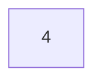
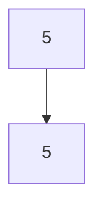
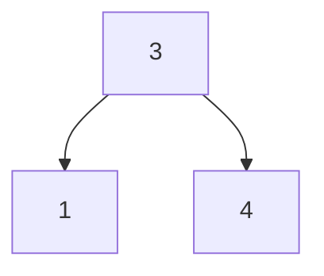
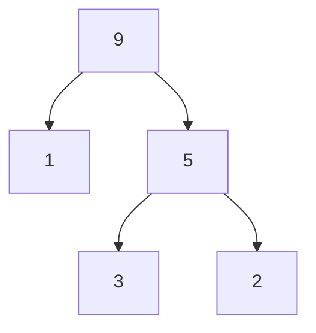

# CBMS-2018-09

**题目来源**：[[做题/文字版题库/CBMS/2018#Question 9|2018#Question 9]]
**日期**：2024-07-27
**题目主题**：CS-Algorithms-Binary Heaps

## 解题思路

这道题目主要考察二叉堆树（Binary Heap Tree）的性质、算法设计与分析。二叉堆树是一种完全二叉树，且满足每个节点的值不小于其子节点的值。解题的关键在于理解二叉堆树的构造与调整操作。

## Solution

### Question 1

**Choose all binary heap trees from the following.**

A binary heap tree is a binary tree where the value of a parent node is no less than the value of any child node.

- (A)

- (B)

- (C)

- (D)

Let's analyze each tree:

- Tree (A) has only one node, so it is a binary heap tree.
- Tree (B) has a root node with value 5 and one child node also with value 5. This satisfies the binary heap property.
- Tree (C) has a root node with value 3, and two child nodes with values 1 and 4. Since $3 < 4$, this does **not** satisfy the binary heap property.
- Tree (D) has a root node with value 9, child nodes with values 1 and 5. The node with value 5 has children with values 3 and 2. This satisfies the binary heap property.

Therefore, the binary heap trees from the given options are (A), (B), and (D).

### Question 2

**Algorithm to make a binary tree $\mathbf{T}$ of height 2 a binary heap tree by exchanging the labels of a node and its child at most once:**

1. **Input:** A binary tree $\mathbf{T}$ of height 2.
2. **Output:** A binary heap tree.

**Algorithm:**

1. Let $\mathbf{r}$ be the root node.
2. Let $\mathbf{c_1}$ and $\mathbf{c_2}$ be the children of $\mathbf{r}$.
3. Compare $\mathbf{c_1}$ with $\mathbf{c_2}$, then compare the larger child with $\mathbf{r}$.
4. If $\mathbf{r}$ is less than the larger child, exchange the labels of $\mathbf{r}$ and the larger child.

This algorithm ensures that the tree satisfies the binary heap property by performing at most one exchange operation per child.

### Question 3

**Algorithm to create a binary heap tree $\mathbf{T'}$ from a tree $\mathbf{T}$ concatenated with two binary heap trees $\mathbf{T_1}$ and $\mathbf{T_2}$:**

1. **Input:** Binary heap trees $\mathbf{T_1}$ and $\mathbf{T_2}$, root node $\mathbf{r}$.
2. **Output:** A binary heap tree $\mathbf{T'}$.

**Algorithm:**

1. Create a new tree $\mathbf{T}$ with root node $\mathbf{r}$.
2. Set the left child of $\mathbf{r}$ as the root of $\mathbf{T_1}$ and the right child of $\mathbf{r}$ as the root of $\mathbf{T_2}$.
3. Perform a `heapify` operation on $\mathbf{r}$:
   - Compare $\mathbf{r}$ with its children.
   - If $\mathbf{r}$ is less than any of its children, exchange the labels of $\mathbf{r}$ and the larger child.
   - Perform the same `heapify` operation on the child node that was exchanged.

The worst-case time complexity of this algorithm is $O(\max(h(\mathbf{T_1}), h(\mathbf{T_2})))$ because the heapify operation will at most traverse the height of the taller tree.

### Question 4

**Algorithm to make a binary tree $\mathbf{T}$ a binary heap tree by iteratively exchanging the labels of a node and its child:**

1. **Input:** A binary tree $\mathbf{T}$.
2. **Output:** A binary heap tree.

**Algorithm:**
1. Start from the last non-leaf node and move upwards to the root node.
2. For each node, perform the "heapify" operation:
   - Compare the node with its children.
   - If the node is less than any of its children, exchange the labels of the node and the larger child.
3. Repeat the process until the root node is processed.

The worst-case time complexity of this algorithm is $O(2^{h(\mathbf{T})})$ because each level of the tree may require exchanges proportional to the number of nodes at that level.

### Question 5

**Algorithm to sort in descending order an array of integers using the operations shown in (4):**

1. **Input:** An array of integers.
2. **Output:** A sorted array in descending order.

**Algorithm:**
1. Build a max-heap from the array using the algorithm from Question 4.
2. Repeatedly extract the maximum element from the heap, replacing it with the last element of the heap, and place the maximum element at the end of the array.
3. Perform heapify on the root node to restore the heap property.

**Steps:**
1. Construct the max-heap:
   - For each node starting from the last non-leaf node to the root, perform heapify.
2. Sort the array:
   - Swap the root of the heap with the last element of the heap.
   - Reduce the heap size by one.
   - Perform heapify on the root.
   - Repeat until the heap size is 1.

The worst-case time complexity of this sorting algorithm is $O(n \log n)$, where $n$ is the number of elements in the array. This is because building the heap takes $O(n)$ time, and each of the $n-1$ extractions takes $O(\log n)$ time.

---

## 知识点

#堆 #二叉堆 #Heapify

## 难点思路

问题 4 的算法是关键，需要理解 heapify 操作以及其时间复杂度分析。

## 解题技巧和信息

1. 构造二叉堆时，使用自底向上的 `heapify` 操作，确保每个子树都是一个堆。
2. 在堆排序中，最大元素总是堆顶，通过交换堆顶和末尾元素并缩小堆大小，可以逐步将数组排序。

## 重点词汇

- Binary Heap 二叉堆
- Heapify 堆化
- Tree Height 树高

## 参考资料

1. Introduction to Algorithms, Cormen et al., Chap. 6. Heapsort
2. Data Structures and Algorithm Analysis in C, Mark Allen Weiss, Chap. 5. Priority Queues
