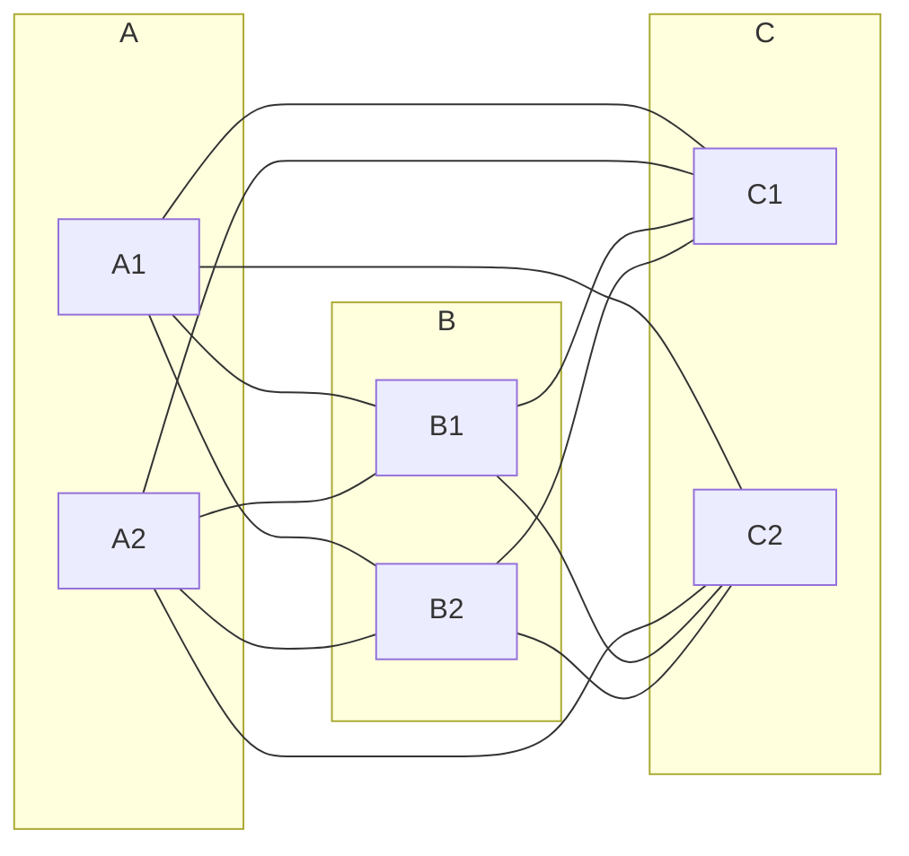

# CBMS-2024B-09

**题目来源**：[[2024B#Question 9]]
**日期**：2024-08-04
**题目主题**：CS-离散数学-图论

## 解题思路

1. **绘制图**：根据题目描述，需要绘制出一个包含三组顶点的三部完全图 $K_{2,2,2}$。三组顶点分别有 2 个顶点，每组内的顶点不相连，不同组间的顶点全连。
2. **计算边数**：分析 $K_{r,s,t}$ 的结构，每个顶点与其他两组的顶点相连，通过组合计数确定边的数量。
3. **证明图的连通性**：利用组合数学和图论基本定理证明在满足边数大于某一临界值的情况下图是连通的。
4. **证明欧拉图顶点度数为偶数**：利用欧拉回路的定义和图论定理，证明欧拉图中所有顶点的度数为偶数。
5. **证明度数为偶数的连通图是欧拉图**：结合欧拉定理，说明在连通图中如果所有顶点的度数为偶数，则该图是欧拉图。

## Solution

### 1. Draw $K_{2,2,2}$

The complete tripartite graph $K_{2,2,2}$ consists of three sets of vertices: $\{A_1, A_2\}$, $\{B_1, B_2\}$, and $\{C_1, C_2\}$. Each vertex in a set is connected to all vertices in the other two sets, but not to vertices within its own set. The graph can be drawn as follows:

### 2. Find the number of edges in $K_{r,s,t}$

In $K_{r,s,t}$, every vertex in one set is connected to every vertex in the other two sets. Hence, the total number of edges is:

$$
\text{Number of edges} = rs + rt + st
$$

### 3. Prove that a simple graph satisfying the inequality $m > \left(\binom{n - 1}{2}\right)$ is connected

To prove the graph is connected, we assume the opposite and show that it leads to a contradiction.

1. **Assumption (Contradiction Hypothesis)**:
   Assume that the graph $G$ is not connected. This means $G$ can be split into at least two disconnected components.

2. **Properties of Disconnected Graphs**:
   - Let the graph $G$ have $k$ components, where $k \geq 2$.
   - Let the sizes of these components be $n_1, n_2, \ldots, n_k$ such that $n_1 + n_2 + \ldots + n_k = n$ and $n_i \geq 1$ for all $i$.
   - The maximum number of edges in a component with $n_i$ vertices is $\binom{n_i}{2}$.

3. **Total Number of Edges in a Disconnected Graph**:
   The total number of edges $m$ in a disconnected graph can be written as:

   $$

   m \leq \sum_{i=1}^{k} \binom{n_i}{2}

   $$

   Since $\sum_{i=1}^{k} n_i = n$, and each component can at most have $\binom{n_i}{2}$ edges, the sum $\sum_{i=1}^{k} \binom{n_i}{2}$ reaches its maximum when one component has $n - 1$ vertices and the remaining component has 1 vertex. This configuration provides the maximum number of edges, which is given by:

   $$

   \sum_{i=1}^{k} \binom{n_i}{2} \leq \binom{n-1}{2}

   $$

4. **Contradiction**:
   By the initial problem statement, $m > \binom{n - 1}{2}$. However, from the assumption of the graph being disconnected, we deduced that $m \leq \binom{n - 1}{2}$, which leads to a contradiction.

5. **Conclusion**:
   Since our assumption that the graph is disconnected leads to a contradiction, the graph must be connected. Hence, a simple graph with $m > \binom{n - 1}{2}$ edges must be connected.

### 4. Show that the degree of every vertex of an Eulerian graph is even

An Eulerian graph contains an Eulerian circuit, which is a closed trail that visits every edge exactly once and returns to the starting vertex. In such a circuit, every time a vertex is entered, it must be exited. Therefore, the number of edges incident to each vertex (the degree) must be even to ensure the vertex can be entered and exited the same number of times.

### 5. Show that a connected graph is an Eulerian graph if the degree of every vertex is even

- A connected graph is Eulerian if and only if all vertices have even degree (Euler's Theorem).
- Assume a connected graph where every vertex has an even degree.
- Starting from any vertex, traverse the graph using available edges, ensuring each edge is used exactly once until returning to the starting vertex.
- Since each vertex has an even degree, it is always possible to enter and exit every vertex during the traversal.
- Thus, the traversal forms an Eulerian circuit, proving the graph is Eulerian.

## 知识点

#图论 #三部图 #欧拉图

## 解题技巧和信息

1. 在计算图的边数时，通常可以通过分析图的结构和顶点间的连通性来进行组合计数。
2. 对于连通图的证明，可以利用边数和顶点数之间的关系以及基本图论定理。
3. 证明欧拉图的性质时，常需要考虑图的边的遍历和顶点度数的关系。

## 重点词汇

- Complete tripartite graph 完全三部图
- Vertex 顶点
- Edge 边
- Connected 连通
- Eulerian graph 欧拉图
- Degree 度数

## 参考资料

1. West, D. B. (2001). Introduction to Graph Theory. Prentice Hall. Chap. 1-4.
2. Diestel, R. (2017). Graph Theory (5th ed.). Springer. Chap. 1-2.
