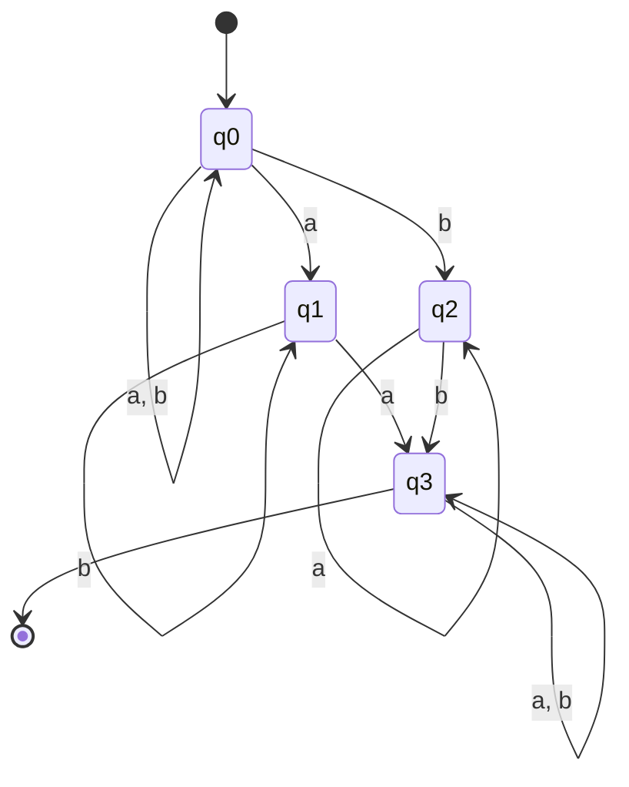
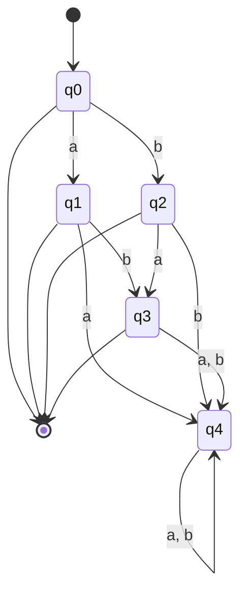

# IS CS-2017S1-01

**题目来源**：[[2017S1#Problem 1]]
**日期**：2024-08-09
**题目主题**: CS-Formal Languages-Regular Languages

## 解题思路

这个问题涉及有限自动机的构造和正则语言的性质。我们需要构造一个 NFA 以满足特定语言的描述，证明任意有限语言都是正则的，然后构造 DFA 来识别补语言。最后，我们需要为判断 NFA 识别的语言是否是无穷集提供一个决策过程。

## Solution

### Question 1

**Problem:** Design an NFA $A_1$ such that $\mathcal{L}(A_1) = L_1$, where $L_1 = \{w \in \Sigma^* \mid \text{there is a character } l \in \Sigma \text{ that occurs more than once in } w\}$, and the number of states of $A_1$ is not greater than 4.

**Solution:**

To solve this, we can create an NFA $A_1$ that detects if any character (either 'a' or 'b') occurs more than once in a string $w$. The automaton will have 4 states to achieve this.

**States:**
- $q_0$: Start state, initial state, no repeated character detected.
- $q_1$: An 'a' has been seen.
- $q_2$: A 'b' has been seen.
- $q_3$: Accept state, a repeat of either 'a' or 'b' has been detected.

**Transitions:**
- From $q_0$:
  - On 'a', go to $q_0$, $q_1$.
  - On 'b', go to $q_0$, $q_2$.
- From $q_1$:
  - On 'a', go to $q_3$ (accept state, since 'a' is repeated).
  - On 'b', remain in $q_1$.
- From $q_2$:
  - On 'b', go to $q_3$ (accept state, since 'b' is repeated).
  - On 'a', remain in $q_2$.
- From $q_3$:
  - On any input, stay in $q_3$.

This NFA is illustrated by the following mermaid diagram:

### Question 2

**Problem:** Prove that any finite language $L = \{w_1, \ldots, w_n\} \subseteq \Sigma^*$ is regular.

**Solution:**

A language is regular if there exists a finite automaton that recognizes it. Given a finite language $L = \{w_1, \ldots, w_n\}$, we can construct a finite automaton (specifically a DFA) that recognizes exactly this set of strings.

**Proof:**
1. Consider each word $w_i \in L$. Since $w_i$ is finite, we can construct a path in a DFA that accepts $w_i$.
2. Create a unique path from the start state to an accept state for each word $w_i$. The DFA will move through states corresponding to the characters of $w_i$ and reach a final state when the entire word is read.
3. Since $L$ is finite, the DFA will have a finite number of paths, each corresponding to one word in $L$.
4. Thus, the DFA has a finite number of states and recognizes $L$. Hence, $L$ is regular.

### Question 3

**Problem:** Design a DFA $A_2$ such that $\mathcal{L}(A_2) = \Sigma^* \setminus L_1$, where $L_1$ is the language from Question 1. The number of states in $A_2$ should not exceed 5.

**Solution**:

To accept the complement of $L_1$, we should focus on strings where no character appears more than once. These strings include $\varepsilon$ (the empty string), "a", "b", "ab", and "ba". Any other string would contain repeated characters.

Let's define the DFA $A_2 = (Q, \Sigma, \delta, q_0, F)$ where:

- **States:** $Q = \{q_0, q_a, q_b, q_{ab/ba}, q_{err}\}$
- **Alphabet:** $\Sigma = \{a, b\}$
- **Transition Function:** $\delta$ is defined as:
  - $\delta(q_0, a) = q_a$
  - $\delta(q_0, b) = q_b$
  - $\delta(q_a, b) = q_{ab/ba}$, $\delta(q_a, a) = q_{err}$
  - $\delta(q_b, a) =  q_{ab/ba}$, $\delta(q_b, b) = q_{err}$
  - $\delta(q_{ab/ba}, a) = q_{err}$, $\delta( q_{ab/ba}, b) = q_{err}$
- **Start State:** $q_0$
- **Accept States:** $F = \{q_0, q_a, q_b, q_{ab}, q_{ba}\}$

Here is the breakdown of the DFA's behavior:

- **$q_0$**: The initial state that accepts the empty string $\varepsilon$.
- **$q_a$**: This state is reached after reading "a" and can move to $q_{ab}$ if "b" follows.
- **$q_b$**: This state is reached after reading "b" and can move to $q_{ba}$ if "a" follows.
- **$q_{ab/ba}$**: This state is reached after reading "ab" or "ba", and does not accept any further input.
- $q_{err}$: Any transition that introduces a repeated character will move the DFA to a trap state where no further transitions lead to an accepting state.

### Question 4

Given an NFA $A = (Q, \Sigma, \delta, q_0, F)$, where:

- $Q$ is the set of states
- $\Sigma$ is the alphabet
- $\delta$ is the transition function
- $q_0$ is the initial state
- $F$ is the set of final states

Follow these steps to determine if $\mathcal{L}(A)$ is infinite:

1. Convert the NFA $A$ to an equivalent DFA $A'$ using the subset construction method.

2. In the resulting DFA $A'$, identify all states reachable from the initial state by performing a depth-first search (DFS) or breadth-first search (BFS).

3. Construct a directed graph $G$ where:
   - Vertices represent the reachable states of $A'$
   - Edges represent transitions between states

4. Perform a topological sort on $G$. If a cycle is detected during this process, proceed to step 5. Otherwise, go to step 6.

5. If a cycle is found:
   - Check if there exists a path from any state in the cycle to a final state in $A'$.
   - If such a path exists, $\mathcal{L}(A)$ is infinite. Terminate the procedure.

6. If no cycle is found or no cycle leads to a final state:
   - $\mathcal{L}(A)$ is finite if and only if for each path from the initial state to a final state, the length of the path is less than $|Q|$ (the number of states in the original NFA $A$).
   - Check all such paths. If any path has length $\geq |Q|$, $\mathcal{L}(A)$ is infinite. Otherwise, it is finite.

**Correctness**:

- If there's a cycle that can reach a final state, we can pump the cycle arbitrarily many times to generate infinitely many accepted strings.
- If there's no such cycle, the only way to have infinitely many strings is if there's a path longer than the number of states, which would imply a cycle by the pigeonhole principle.

## 知识点

#正则语言 #NFA #DFA #补语言

## 重点词汇

1. Finite Automaton (有限自动机)
2. Regular Language (正则语言)
3. Deterministic Finite Automaton (确定有限自动机)
4. Nondeterministic Finite Automaton (非确定有限自动机)
5. Language Complement (语言的补集)
6. Cycle Detection (环检测)

## 参考资料

1. Michael Sipser, *Introduction to the Theory of Computation*, Chapter 1.
2. John E. Hopcroft, Rajeev Motwani, Jeffrey D. Ullman, *Introduction to Automata Theory, Languages, and Computation*, Chapter 2.
