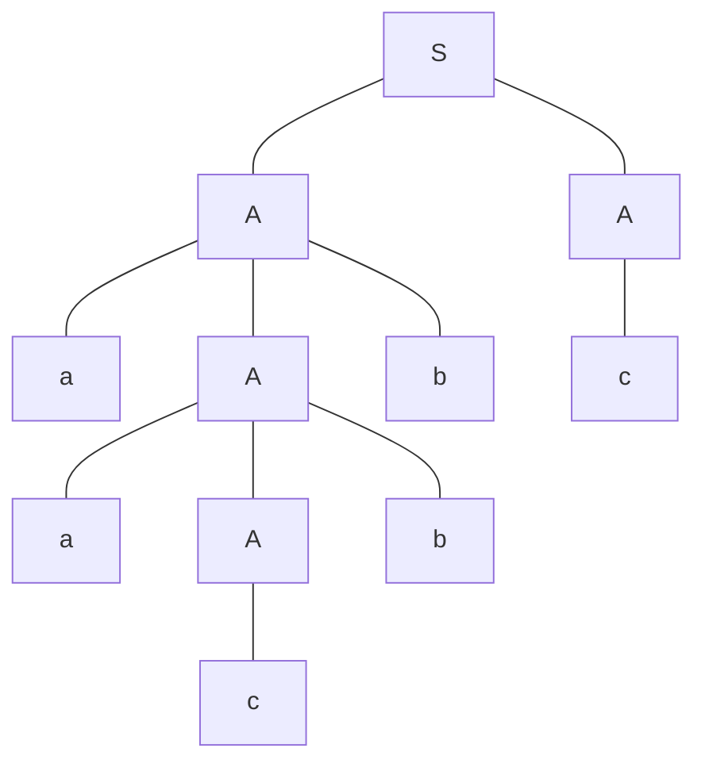

# IS CS-2018S1-02

**题目来源**：[[2018S1#Problem 2]]
**日期**：2024-08-07
**题目主题**：CS-形式语言与自动机-上下文无关文法

## 解题思路

本题涉及对上下文无关文法（Context-Free Grammar, CFG）的理解和操作，包括生成语言的描述、推导树的绘制、以及通过抽象结果证明某些语言不可由上下文无关文法生成。我们将依次回答每个小问题，提供详细的推导和证明。

## Solution

### Question 1

To derive the word $aacbbc$ in the grammar $G_0$, we can construct the following syntax tree:

Explanation:

- Start from $S$ and use the rule $S \rightarrow AA$.
- For the left $A$, we use $A \rightarrow aAb$ followed by $A \rightarrow aAb$ and then $A \rightarrow c$.
- For the right $A$, we use $A \rightarrow c$.

### Question 2

To find the words $u, v, w, x, y$ such that:

1. $uvwxy = acbc$
2. $uv^nwx^ny \in \mathcal{L}(G_0)$ for every $n \geq 0$
3. $|vx| > 0$

Let's consider $acbc$:

- **$u = \epsilon$, $v = a$, $w = c$, $x = b$, $y = c$**

This satisfies all the conditions:

- $uvwxy = acbc$
- For any $n \geq 0$, $uv^nwx^ny = a^ncb^nc$ which is in $\mathcal{L}(G_0)$ because $a^ncb^nc$ can be derived by $n$ applications of $A \rightarrow aAb$ and then $A \rightarrow c$.
- $|vx| = |a| + |b| = 2 > 0$

### Question 3

To prove that for every context-free grammar $G$ there exists an integer $N$ such that for every word $z \in \mathcal{L}(G)$ with $|z| > N$, there exist words $u, v, w, x, y$ satisfying:

1. $z = uvwxy$
2. $uv^nwx^ny \in \mathcal{L}(G)$ for every $n \geq 0$
3. $|vx| > 0$
4. $|wvx| \leq N$

#### Proof Outline

1. **Chomsky Normal Form**: Any CFG can be converted to Chomsky Normal Form (CNF) where each production is of the form $A \rightarrow BC$ or $A \rightarrow a$.
2. **Pumping Lemma for CFLs**: If $z$ is derived by a CFG with more than $N$ derivations, some non-terminal must repeat due to the pigeonhole principle.
3. **Pumping Length $N$**: Choose $N$ as the maximum number of unique derivations before a non-terminal repeats.

#### Detailed Proof

1. **Derivation Tree**: Consider a derivation tree for a word $z \in \mathcal{L}(G)$. In CNF, each internal node has two children, resulting in a binary tree structure.
2. **Repetition of Non-Terminals**: If the length of $z$ exceeds $N$, due to CNF and finite number of non-terminals, there must be a path from the root to a leaf with a repeated non-terminal.
3. **Decomposition into $uvwxy$**: The repeated non-terminal defines the segments $v$ and $x$ such that the string can be decomposed into $uvwxy$.
4. **Pumping Condition**: Repeating the repeated portion ($v$ and $x$) any number of times results in words still derivable by $G$, i.e., $uv^nwx^ny \in \mathcal{L}(G)$.

### Question 4

#### 1. Setup

Let's assume, for the sake of contradiction, that $L = \{ ww \mid w \in \{a, b\}^* \}$ is context-free.

#### 2. Applying the Pumping Lemma

By the pumping lemma for context-free languages, there exists a pumping length $p > 0$ such that for any string $s \in L$ with $|s| \geq p$, we can write $s = uvxyz$ where:

1. $|vxy| \leq p$
2. $|vy| \geq 1$
3. $uv^ixy^iz \in L$ for all $i \geq 0$

#### 3. Choosing a String

Let's choose the string $s = a^p b^p a^p b^p$. Clearly, $s \in L$ and $|s| = 4p \geq p$.

#### 4. Analyzing the Decomposition

Now, $s = uvxyz$. Due to condition 1, $vxy$ must be entirely within the first half of $s$ (i.e., within $a^p b^p$) or entirely within the second half (i.e., within $a^p b^p$), or it must straddle the middle.

#### 5. Case Analysis

##### Case 1: $vxy$ is entirely within $a^p b^p$

In this case, pumping $v$ and $y$ will change the first half of the string but not the second half. Thus, $uv^2xy^2z \notin L$ because it's no longer of the form $ww$.

##### Case 2: $vxy$ straddles the middle

In this case, $v$ or $y$ (or both) must contain both $a$'s and $b$'s. Pumping will change the number of $a$'s and $b$'s in a way that can't be matched in both halves of the string. Thus, $uv^2xy^2z \notin L$.

##### Case 3: $vxy$ is entirely within the second $a^p b^p$

This case is similar to Case 1. Pumping will change the second half of the string but not the first half, resulting in $uv^2xy^2z \notin L$.

#### 6. Conclusion

In all cases, we can find an $i$ (specifically, $i = 2$) such that $uv^ixy^iz \notin L$. This contradicts condition 3 of the pumping lemma.

Therefore, our initial assumption must be false, and $L$ is not context-free.

## 知识点

#上下文无关文法 #Chomsky范式 #泵引理

## 解题技巧和信息

1. **上下文无关文法的定义**：包括推导树和语言生成的规则。
2. **Chomsky 范式**：将 CFG 转换为 CNF，使每个产生式最多有两个非终结符，或一个终结符。
3. **Pump Lemma**：关键工具，用于证明某些语言不是上下文无关语言。主要思想是超长的字符串可以被”泵出”，并且结果仍然在语言中。

## 重点词汇

1. Context-Free Grammar 上下文无关文法
2. Chomsky Normal Form Chomsky 范式
3. Pumping Lemma Pumping 引理

## 参考资料

1. Michael Sipser, *Introduction to the Theory of Computation*, Chapter 2: Context-Free Grammars and Languages.
