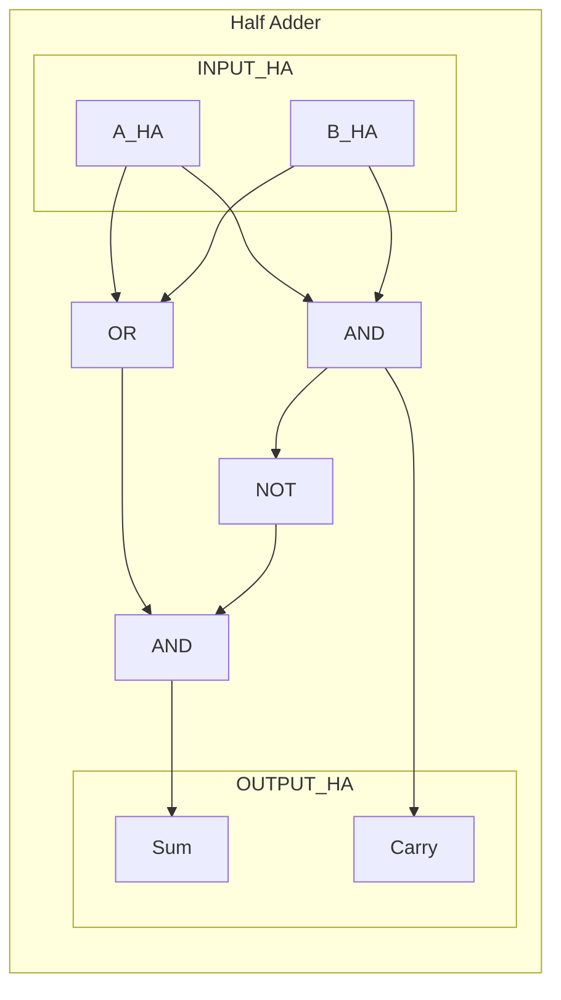
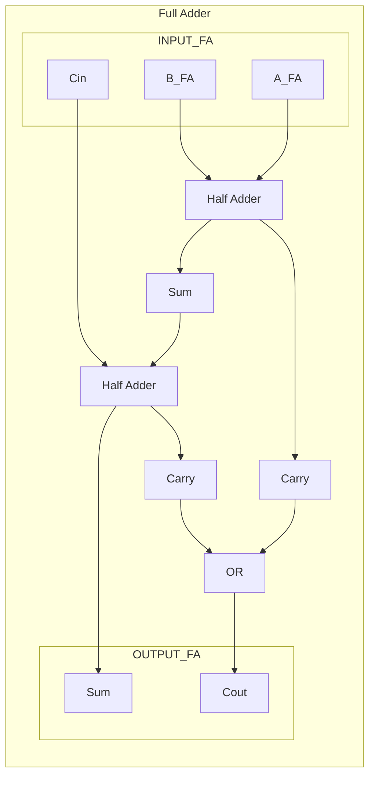

# IS CS-2019S1-01

**题目来源**：[[2019S1#Problem 1]]
**日期**：2024-08-02
**题目主题**：CS-数字电路-加法器与乘法器设计

## 解题思路

这道题目涉及数字电路设计，主要考察加法器和乘法器的设计原理。我们需要从最基本的半加器和全加器开始，然后逐步构建更复杂的电路。解题过程中，我们需要注意以下几点：

1. 理解半加器和全加器的原理及其逻辑门实现。
2. 掌握多位加法器的设计方法，特别是如何并行处理以减少延迟。
3. 理解乘法器的基本原理，以及如何利用加法器来构建乘法器。
4. 注意题目对电路设计的特殊要求，如不允许加法器串联或最小化串联加法器的数量。

## Solution

### 1. Half Adder and Full Adder Design

#### Half Adder

A half adder adds two single binary digits $A$ and $B$. It has two outputs: sum ($S$) and carry ($C$).

Logic equations:

- $S = A \oplus B$ (XOR)
- $C = A \cdot B$ (AND)

Since we can only use AND, OR, and NOT gates, we need to implement XOR using these basic gates:

$A \oplus B = (A + B) \cdot (\overline{A \cdot B})$

Circuit design:

#### Full Adder

A full adder adds three single binary digits $A$, $B$, and $C_{in}$ (previous carry). It has two outputs: sum ($S$) and carry ($C_{out}$).

Logic equations:

- $S = A \oplus B \oplus C_{in}$
- $C_{out} = (A \cdot B) + (C_{in} \cdot (A \oplus B))$

Circuit design using half adders:

## 2. Three 16-bit Integer Adder

Let's denote the bits and FA as:

$\mathbf{a} = (a_{15}, …, a_0)$, $\mathbf{b} = (b_{15}, …, b_0)$, $\mathbf{c} = (c_{15}, …, c_0)$

$\mathbf{d} = (d_{16}, …, d_0)$, $\mathbf{e} = (e_{16}, …, e_0)$

 $FA(a, b, C_{in}) = (S, C_{out})$

### Design

1. **Main layer**: For each bit position $i$ (0 to 15), use a 1-bit Full Adder (FA) to add $a_i$, $b_i$, and $c_i$.
   $(d_i, e_{i+1}) = FA(a_i, b_i, c_i)$

2. **Final steps**:
   $d_{16} = 0$
   $e_0 = 0$

### Explanation

1. This design uses only one layer of 1-bit full adders, which satisfies the requirement that no adders can be connected in series.
2. For each bit position $i$, we add $a_i$, $b_i$, and $c_i$ using a full adder. The sum output of this FA becomes $d_i$, and the carry output becomes $e_{i+1}$.
3. The carry out from the most significant bit, MSB (i.e., from adding $a_{15}$, $b_{15}$, and $c_{15}$) becomes $e_{16}$.
4. We set $d_{16} = 0$ and $e_0 = 0$ because there's no overflow for the MSB and no carry-in for the least significant bit, LSB.

### Correctness

This design correctly computes $\mathbf{a} + \mathbf{b} + \mathbf{c} = \mathbf{d} + \mathbf{e}$ because:

1. For each bit position, we're adding all three input bits and producing two output bits (one for $\mathbf{d}$ and one for $\mathbf{e}$).
2. The carry propagation is handled by using $e_{i+1}$ as the carry output for each FA, effectively shifting the carries one position to the left in $\mathbf{e}$.
3. The most significant carry is correctly handled by setting $d_{16} = e_{16}$.

This design satisfies all the problem constraints while providing an efficient solution using only 16 1-bit full adders. It doesn't use any half adders in this case, as full adders are sufficient and more efficient for this particular problem.

## 3. Four 16-bit Integer Adder

Let's denote the bits as:

$\mathbf{a}_1 = (a1_{15}, …, a1_0)$, $\mathbf{a}_2 = (a2_{15}, …, a2_0)$, $\mathbf{a}_3 = (a3_{15}, …, a3_0)$, $\mathbf{a}_4 = (a4_{15}, …, a4_0)$

$\mathbf{b}_1 = (b1_{16}, …, b1_0)$, $\mathbf{b}_2 = (b2_{16}, …, b2_0)$

### Design

1. **First stage**: Use the solution from [[IS_CS-2019S1-01#2. Three 16-bit Integer Adder|Problem 2]] to add $\mathbf{a}_1$, $\mathbf{a}_2$, and $\mathbf{a}_3$.
   For each bit position $i$ (0 to 15):
	   $(t_i, u_{i+1}) = FA(a1_i, a2_i, a3_i)$
   Set $u_0 = 0$

   Now we have $\mathbf{t}$ (16 bits) and $\mathbf{u}$ (17 bits) such that $\mathbf{a}_1 + \mathbf{a}_2 + \mathbf{a}_3 = \mathbf{u} + \mathbf{t}$

   Set $\mathbf{b}_1 = \mathbf{u}$

2. **Second stage**: Add $\mathbf{a}_4$ (16 bits) and $\mathbf{t}$ (16 bits).
   For each bit position $i$ (0 to 15):
	   $(b2_i, c_i) = FA(a4_i, t_i, c_{i-1})$  (use $c_{-1} = 0$)
   Set $b2_{16} = c_{15}$

### Explanation

1. In the first stage, we use the solution from [[IS_CS-2019S1-01#2. Three 16-bit Integer Adder|Problem 2]] to add three 16-bit integers ($\mathbf{a}_1$, $\mathbf{a}_2$, $\mathbf{a}_3$). This gives us a 17-bit integer $\mathbf{u}$ and a 16-bit integer $\mathbf{t}$.
2. In the second stage, we add the fourth 16-bit integer $\mathbf{a}_4$ to the 16-bit integer $\mathbf{t}$. This addition can be done with a single layer of full adders, producing a 17-bit integer $\mathbf{b}_2$.
3. We can directly use $\mathbf{t}$ as $\mathbf{b}_1$ without any further additions.

This design minimizes the maximum number of adders connected in series to just two layers.

## 4. 8-bit Integer Multiplier

Let's denote the bits as:

$\mathbf{a} = (a_7, …, a_0)$, $\mathbf{b} = (b_7, …, b_0)$

### Design

1. Generate partial products:
   Use $8 \times 8$ one-bit multipliers to compute $p_{ij} = a_i \times b_j$ for $0 \leq i, j \leq 7$.

2. Arrange partial products:
   $P_0 = (p_{07}, p_{06}, p_{05}, p_{04}, p_{03}, p_{02}, p_{01}, p_{00})$
   $P_1 = (p_{17}, p_{16}, p_{15}, p_{14}, p_{13}, p_{12}, p_{11}, p_{10}, 0)$
   $P_2 = (p_{27}, p_{26}, p_{25}, p_{24}, p_{23}, p_{22}, p_{21}, p_{20}, 0, 0)$
   …
   $P_7 = (p_{77}, p_{76}, p_{75}, p_{74}, p_{73}, p_{72}, p_{71}, p_{70}, 0, 0, 0, 0, 0, 0, 0)$

3. Sum partial products:
   Use a tree of 1-bit FAs and HAs to sum these partial products. We can use a Wallace tree structure to minimize the depth of the circuit:

   - Layer 1: Group $P_0$, $P_1$, $P_2$, $P_3$ and adding them with Four 16-bit Integer Adders in [[#3. Four 16-bit Integer Adder|Problem 3]]. Same for $P_4$, $P_5$, $P_6$, $P_7$.
   - Layer 2: Take the four results (at most 17-bit integers) from Layer 1 and sum them using similar Four 17-bit Integer Adders in [[#3. Four 16-bit Integer Adder|Problem 3]].

4. Final result:
   The two output integer from Four 17-bit Integer Adders.

This design efficiently computes the product using only the specified components (1-bit adders and multipliers) while minimizing the depth of the circuit.

## 知识点

#数字电路 #加法器 #乘法器 #组合逻辑电路设计

## 难点思路

本题的难点主要在于如何在满足题目约束的情况下设计高效的电路。特别是在第 3 问中，需要巧妙地安排加法器以最小化串联加法器的数量，同时又要确保正确性。在第 4 问中，需要理解如何将乘法转化为加法运算，并且在设计中充分利用并行性来提高效率。

## 解题技巧和信息

1. 在设计复杂电路时，先从基本构建块（如半加器和全加器）开始，然后逐步构建更复杂的电路。
2. 利用并行设计来减少延迟和提高效率。例如，在三个 16 位整数加法器中，我们同时进行两组加法运算，而不是串行处理。
3. 在设计多位加法器时，考虑使用树形结构来最小化加法器的串联数量。这在四个 16 位整数加法器的设计中尤为明显。
4. 在乘法器设计中，将问题分解为部分积的生成和求和两个步骤。部分积的生成可以完全并行，而求和过程可以通过优化的加法器树来实现。
5. 注意题目的特殊要求，如不允许加法器串联或最小化串联加法器的数量。这些要求通常会影响电路的整体架构。
6. 在复杂的设计中，画出数据流图或框图可以帮助理清思路，确保所有的数据都被正确处理。

## 重点词汇

- Half adder 半加器
- Full adder 全加器
- Carry 进位
- Sum 和
- Partial product 部分积
- Multiplier 乘法器
- Logic gate 逻辑门
- AND gate 与门
- OR gate 或门
- NOT gate 非门
- XOR gate 异或门
- Combinational logic 组合逻辑
- Parallel design 并行设计
- Adder tree 加法器树
- Bit-wise operation 按位操作

## 参考资料

1. Digital Design by M. Morris Mano, Chapter 4: Combinational Logic
2. Computer Organization and Design by David A. Patterson and John L. Hennessy, Chapter 3: Arithmetic for Computers
3. Digital Integrated Circuits: A Design Perspective by Jan M. Rabaey, Chapter 7: Combinational Circuit Design
4. CMOS VLSI Design: A Circuits and Systems Perspective by Neil H. E. Weste and David Harris, Chapter 10: Datapath Subsystems
