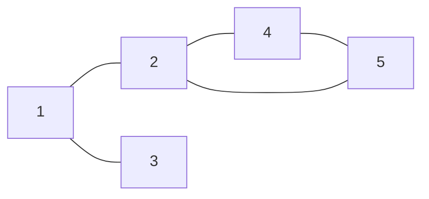
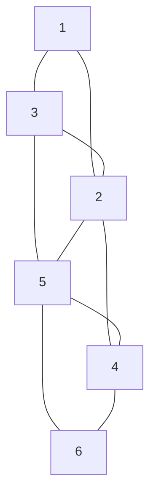

# 2024A

## Question 7

For real number $n$ $(> 1)$ and non-negative integer $i$, let $f^{(i)}(n)$ denote the function $f$ applied $i$ times iteratively to $n$; namely, $f^{(0)}(n) = n$ and $f^{(i)}(n) = f(f^{(i-1)}(n))$ if $i > 0$. If $f^{(i)}(n) \leq 1$ for some $i$, define $f^{*}(n)$ as the minimum such $i$; namely, $f^{*}(n) = \min \{ i > 0 \mid f^{(i)}(n) \leq 1 \}$. Otherwise, $f^{*}(n)$ is undefined. Answer each of the following questions and the reasoning behind it.

(1) When $f(n) = \frac{n}{2}$, show $f^{*}(n) = \lceil \log_2 n \rceil$ ($\lceil x \rceil$ is the minimum integer that is $x$ or more).

(2) When $f(n) = \log_2 n$, answer the minimum value of $n$ that satisfies $f^{*}(n) = 5$.

(3) When $f(n) = \log_2 n$, which is greater or equal, $f(f^{*}(n))$ or $f^{*}(f(n))$?

---

对于实数 $n$ $(> 1)$ 和非负整数 $i$，设 $f^{(i)}(n)$ 表示将函数 $f$ 迭代地应用于 $n$ $i$ 次；即 $f^{(0)}(n) = n$ 并且 $f^{(i)}(n) = f(f^{(i-1)}(n))$ 当 $i > 0$。如果 $f^{(i)}(n) \leq 1$ 对某些 $i$ 成立，定义 $f^{*}(n)$ 为最小的 $i$；即 $f^{*}(n) = \min \{ i > 0 \mid f^{(i)}(n) \leq 1 \}$。否则，$f^{*}(n)$ 未定义。回答以下每个问题并解释其背后的理由。

(1) 当 $f(n) = \frac{n}{2}$ 时，证明 $f^{*}(n) = \lceil \log_2 n \rceil$ （$\lceil x \rceil$ 是大于或等于 $x$ 的最小整数）。

(2) 当 $f(n) = \log_2 n$ 时，回答满足 $f^{*}(n) = 5$ 的 $n$ 的最小值。

(3) 当 $f(n) = \log_2 n$ 时，比较 $f(f^{*}(n))$ 和 $f^{*}(f(n))$ 哪个更大或相等？

---

## Question 8

Answer the following questions regarding the transition matrix $$\mathbf{P} = \begin{pmatrix}

1 - p & p \\

q & 1 - q

\end{pmatrix}$$,

$0 < p < 1, 0 < q < 1, p + q \neq 1$.

(1) Show that the vector $$\begin{pmatrix}

p \\

-q

\end{pmatrix}$$ is an eigenvector of $\mathbf{P}$.

(2) Find the $n$-th order transition matrix $\mathbf{P}^n$.

(3) Find $\lim_{n \to \infty} \mathbf{P}^n$.

The trace of an $n \times n$ real-valued matrix $\mathbf{A} = (a_{ij})_{1 \leq i, j \leq n}$ is defined as $\mathrm{tr}\, \mathbf{A} = \sum_{i=1}^{n} a_{ii}$. Answer the following questions.

(4) Prove that $\mathrm{tr}\, \mathbf{A} = \sum_{i=1}^{n} \lambda_i$ where the eigenvalues of $\mathbf{A}$ are described as $\lambda_1, \dots, \lambda_n$.

(5) Prove the following: If there exists a natural number $m$ such that $\mathbf{A}^m = \mathbf{O}$ ($\mathbf{O}$ is the zero matrix), then $\mathrm{tr}\, \mathbf{A} = 0$.

---

回答以下关于转移矩阵 $$\mathbf{P} = \begin{pmatrix}

1 - p & p \\

q & 1 - q

\end{pmatrix}$$ 的问题，

$0 < p < 1, 0 < q < 1, p + q \neq 1$。

(1) 证明向量 $$\begin{pmatrix}

p \\

-q

\end{pmatrix}$$ 是 $\mathbf{P}$ 的一个特征向量。

(2) 求 $n$ 阶转移矩阵 $\mathbf{P}^n$。

(3) 求 $\lim_{n \to \infty} \mathbf{P}^n$。

一个 $n \times n$ 实数值矩阵 $\mathbf{A} = (a_{ij})_{1 \leq i, j \leq n}$ 的迹定义为 $\mathrm{tr}\, \mathbf{A} = \sum_{i=1}^{n} a_{ii}$。回答以下问题。

(4) 证明 $\mathrm{tr}\, \mathbf{A} = \sum_{i=1}^{n} \lambda_i$，其中 $\mathbf{A}$ 的特征值为 $\lambda_1, \dots, \lambda_n$。

(5) 证明以下命题：如果存在自然数 $m$ 使得 $\mathbf{A}^m = \mathbf{O}$（$\mathbf{O}$ 是零矩阵），则 $\mathrm{tr}\, \mathbf{A} = 0$。

---

## Question 9

Here is an example of a graph, and its corresponding adjacency list:



$$

\begin{align*}

1: & \ 2, 3 \\

2: & \ 1, 4, 5 \\

3: & \ 1 \\

4: & \ 2, 5 \\

5: & \ 2, 4 \\

\end{align*}

$$

(1) Write the adjacency list for this graph:



(2) Draw the graph for this adjacency list:

$$

\begin{align*}

1: & \ 2, 3 \\

2: & \ 1\\

3: & \ 1 \\

4: & \ 5, 6 \\

5: & \ 4, 6, 7 \\

6: & \ 4, 5, 7 \\

7: & \ 5, 6 \\

\end{align*}

$$

(3) Suppose we perform a depth-first search of the graph at the top of this page, starting at node 2. Write a possible order in which we might visit the nodes. The first node should be node 2, and the second should be one of the nodes connected to node 2.

(4) Write a possible order in which we might visit the nodes, if we do breadth-first search of the graph at the top of this page, starting at node 2.

(5) Suppose a graph has $n$ nodes, and node $i$ has $m_i$ edges $(1 \leq i \leq n)$. The adjacency list is $A_{ij}$ $(1 \leq i \leq n, 1 \leq j \leq m_i)$. Write pseudocode for an algorithm that outputs the number of connected components, using depth-first search. The algorithm should explicitly use each element of $A_{ij}$.

(6) Write pseudocode for an algorithm that outputs the number of connected components, using breadth-first search. The algorithm should explicitly use each element of $A_{ij}$.

---

这里有一个图的例子及其对应的邻接表：


$$

\begin{align*}

1: & \ 2, 3 \\

2: & \ 1, 4, 5 \\

3: & \ 1 \\

4: & \ 2, 5 \\

5: & \ 2, 4 \\

\end{align*}

$$

(1) 为这个图写出邻接表：


(2) 画出这个邻接表的图：

$$

\begin{align*}

1: & \ 2, 3 \\

2: & \ 1\\

3: & \ 1 \\

4: & \ 5, 6 \\

5: & \ 4, 6, 7 \\

6: & \ 4, 5, 7 \\

7: & \ 5, 6 \\

\end{align*}

$$

(3) 假设我们从图的顶部从节点 2 开始进行深度优先搜索。写出可能访问节点的顺序。第一个节点应该是节点 2，第二个应该是与节点 2 相连的节点之一。

(4) 写出如果我们从节点 2 开始对图进行广度优先搜索时可能访问节点的顺序。

(5) 假设一个图有 $n$ 个节点，节点 $i$ 有 $m_i$ 条边 $(1 \leq i \leq n)$。邻接表是 $A_{ij}$ $(1 \leq i \leq n, 1 \leq j \leq m_i)$。写出一个使用深度优先搜索输出连通分量数的算法伪代码。该算法应明确使用每个 $A_{ij}$ 元素。

(6) 写出一个使用广度优先搜索输出连通分量数的算法伪代码。该算法应明确使用每个 $A_{ij}$ 元素。

---

## Question 10

Given $\mathbf{V}$, an integer array of $N$ elements, the following procedure, `quick_sort` sorts the entire array of $\mathbf{V}$ by calling `quick_sort(0, V, 0, N - 1, -\infty, +\infty)`. `swap(x, y)` is a special procedure that swaps the values of $x$ and $y$.

```python
def quick_sort(d, V, li, hi, lv, hv):
    if hi <= li: return
    p = li; l = li + 1; h = hi

	## (A) begins
    while l < h:
        while l <= hi and V[l] < V[p]: l += 1 # (B): V[l] < V[p]
        while li <= h and V[p] <= V[h]: h -= 1 # (C): V[p] <= V[h]
        if h <= l: break
        swap(V[l], V[h])
        l += 1; h -= 1
    swap(V[p], V[h])
    ## (A) ends
    
    if lv < V[h]: quick_sort(d + 1, V, li, l - 1, lv, V[h])
    if V[h] < hv: quick_sort(d + 1, V, h + 1, hi, V[h], hv)
```

(1) Answer what (A) does over array $\mathbf{V}$.

(2) Answer what $d$ holds.

(3) Let $d_{\max}$ be the maximum $d$ during the entire sorting procedure. Given $N$, show an example of array $\mathbf{V}$ which gives the largest possible $d_{\max}$.

(4) Explain what $lv$ and $hv$ hold.

(5) We modify the program so as to work as is when $d$ is even and as if we swap inequality symbols $(B)$ and $(C)$ when $d$ is odd. Explain what happens if we sort the $\mathbf{V}$ you answered in (3).

(6) Explain the benefits of introducing the modification explained in (5).

---

给定整数数组 $\mathbf{V}$，其包含 $N$ 个元素，以下程序 `quick_sort` 通过调用 `quick_sort(0, V, 0, N - 1, -\infty, +\infty)` 对 $\mathbf{V}$ 的整个数组进行排序。`swap(x, y)` 是一个特殊的过程，用于交换 $x$ 和 $y$ 的值。

```python
def quick_sort(d, V, li, hi, lv, hv):
    if hi <= li: return
    p = li; l = li + 1; h = hi

	// (A) begins
    while l < h:
        while l <= hi and V[l] < V[p]: l += 1
        while li <= h and V[p] <= V[h]: h -= 1
        if h <= l: break
        swap(V[l], V[h])
        l += 1; h -= 1
    swap(V[p], V[h])
    // (A) ends
    
    if lv < V[h]: quick_sort(d + 1, V, li, l - 1, lv, V[h])
    if V[h] < hv: quick_sort(d + 1, V, h + 1, hi, V[h], hv)
```

(1) 解释 (A) 在数组 $\mathbf{V}$ 上的作用。

(2) 解释 $d$ 的含义。

(3) 设 $d_{\max}$ 为整个排序过程中出现的最大 $d$。给定 $N$，展示一个使得 $d_{\max}$ 最大的数组 $\mathbf{V}$ 的例子。

(4) 解释 $lv$ 和 $hv$ 的含义。

(5) 我们修改程序，以便在 $d$ 为偶数时按原样工作，而在 $d$ 为奇数时交换不等式符号 $(B)$ 和 $(C)$。解释如果我们对 (3) 中的 $\mathbf{V}$ 进行排序会发生什么。

(6) 解释引入 (5) 中修改的好处。

---

## Question 11

Let $X_i$ $(i = 1, \dots, n; n \geq 2)$ be $n$ independent nonnegative real-valued random variables with the same probability density function $f(x) = e^{-x}$. Answer the following questions with mathematical derivation.

(1) Compute the mean and variance of $X_i$.

(2) Suppose the value of $X_i$ is given as $x_i$ for some $i$. Compute probability $\mathbb{P}(X_i \leq X_k \mid X_i = x_i)$ that $X_i$ is less than or equal to $X_k$ for a given index $k$ with $k \neq i$.

(3) Compute probability $\mathbb{P}(X_i \leq X_k)$ by multiplying the probability of (2) by $f(x_i)$ and integrating it with respect to $x_i$.

(4) Let $X_{\min} = \min_{k=1,\dots,n} X_k$ be the minimum value of set $\{ X_i \mid i = 1, \dots, n \}$. Compute the probability $\mathbb{P}(x \leq X_{\min})$ that $X_{\min}$ is greater than or equal to $x$ for a given positive real number $x$.

For $n$ given positive real numbers $\lambda_i$ $(i = 1, \dots, n)$, define random variables $Z_i$ $(i = 1, \dots, n)$ as $Z_i = \frac{X_i}{\lambda_i}$.

(5) Suppose the value of $X_i$ is given as $x_i$ for some $i$. Compute probability $\mathbb{P}(Z_i \leq Z_k \mid X_i = x_i)$ that $Z_i$ is less than or equal to $Z_k$ for a given index $k$ with $k \neq i$.

(6) Suppose the value of $X_i$ is given as $x_i$ for some $i$. Compute probability $\mathbb{P}\left(\bigcap_{k=1,\dots,n; k \neq i} \{ Z_i \leq Z_k \} \mid X_i = x_i\right)$ that $Z_i$ is less than or equal to $Z_k$ for all the indices $k$ with $k \neq i$.

(7) Let $Z_I$ be a minimum element in set $\{ Z_i \mid i = 1, \dots, n \}$. Answer the probability distribution $\mathbb{P}(I = i)$ $(i = 1, \dots, n)$ of index $I = \mathop{\arg\min}\limits_{k=1,\dots,n} Z_k$.

---

设 $X_i$ $(i = 1, \dots, n; n \geq 2)$ 是 $n$ 个独立的非负实值随机变量，其概率密度函数为 $f(x) = e^{-x}$。请用数学推导回答以下问题。

(1) 计算 $X_i$ 的均值和方差。

(2) 假设 $X_i$ 的值为 $x_i$，计算 $\mathbb{P}(X_i \leq X_k \mid X_i = x_i)$ 的概率，即 $X_i$ 小于或等于 $X_k$ 的概率，其中 $k \neq i$。

(3) 计算 $\mathbb{P}(X_i \leq X_k)$ 的概率，通过 (2) 的概率乘以 $f(x_i)$ 并对 $x_i$ 积分。

(4) 令 $X_{\min} = \min_{k=1,\dots,n} X_k$ 为集合 $\{ X_i \mid i = 1, \dots, n \}$ 的最小值。计算 $\mathbb{P}(x \leq X_{\min})$ 的概率，即 $X_{\min}$ 大于或等于给定正实数 $x$ 的概率。

对于 $n$ 个给定的正实数 $\lambda_i$ $(i = 1, \dots, n)$，定义随机变量 $Z_i$ $(i = 1, \dots, n)$ 为 $Z_i = \frac{X_i}{\lambda_i}$。

(5) 假设 $X_i$ 的值为 $x_i$，计算 $\mathbb{P}(Z_i \leq Z_k \mid X_i = x_i)$ 的概率，即 $Z_i$ 小于或等于 $Z_k$ 的概率，其中 $k \neq i$。

(6) 假设 $X_i$ 的值为 $x_i$，计算 $\mathbb{P}\left(\bigcap_{k=1,\dots,n; k \neq i} \{ Z_i \leq Z_k \} \mid X_i = x_i\right)$ 的概率，即 $Z_i$ 小于或等于 $Z_k$ 的概率，对于所有 $k \neq i$。

(7) 令 $Z_I$ 为集合 $\{ Z_i \mid i = 1, \dots, n \}$ 中的最小元素。回答索引 $I = \mathop{\arg\min}\limits_{k=1,\dots,n} Z_k$ 的概率分布 $\mathbb{P}(I = i)$ $(i = 1, \dots, n)$。

---

## Question 12

(1) The iterative equations below are for calculation of the score of global alignment of two sequences $x = x_1 \cdots x_m$, $y = y_1 \cdots y_n$, where $s(a, b)$ is the match score of character $a$ and $b$, and $0 < e < d$. The initial values are not shown here.

$$
\begin{align*}
&\text{for } i = 1, \cdots, m \\
&\quad \text{for } j = 1, \cdots, n \\
&\quad \quad M_{i,j} = \max \begin{cases}
M_{i-1,j-1} + s(x_i, y_j) \\
X_{i-1,j-1} + s(x_i, y_j) \\
Y_{i-1,j-1} + s(x_i, y_j)
\end{cases} \\
&\quad \quad X_{i,j} = \max \begin{cases}
M_{i-1,j} - d \\
X_{i-1,j} - e \\
Y_{i-1,j} - d
\end{cases} \\
&\quad \quad Y_{i,j} = \max \begin{cases}
M_{i,j-1} - d \\
X_{i,j-1} - d \\
Y_{i,j-1} - e
\end{cases}
\end{align*}
$$

(1-1) Show the formula of the penalty for a gap of length $k$.

(1-2) Suppose that some of the initial values are

$M_{0,0} = 0$, $X_{0,0} = -\infty$, $Y_{0,0} = -\infty$,

for $j = 1, \cdots, n$: $M_{0,j} = X_{0,j} = -\infty$,

for $i = 1, \cdots, m$: $M_{i,0} = Y_{i,0} = -\infty$.

Show the initial values $X_{i,0}$ $(i = 1, \cdots, m)$ and $Y_{0,j}$ $(j = 1, \cdots, n)$.

(1-3) Show the iterative equations to calculate the maximum score of local alignment using the same type of gap penalty.

(1-4) Explain a method to get a local alignment with the maximum score using the calculation of (1-3).

(2) There is a sequence $x = x_1 \cdots x_m$ consisting of $a, c, g, t$. Define the complementary character of $a, c, g, t$ as

$$
\begin{align*}
\text{comp}(a) &= t, \\
\text{comp}(c) &= g, \\
\text{comp}(g) &= c, \\
\text{comp}(t) &= a.
\end{align*}
$$

(2-1) Explain what is reported by the following algorithm.

$$
\begin{align*}
&\text{for } i = 1, \cdots, m: H_{i,m+1} = 0 \\
&\text{for } j = 1, \cdots, m + 1: H_{0,j} = 0 \\
&\text{for } i = 1, \cdots, m \\
&\quad \text{for } j = m, \cdots, i \\
&\quad \quad \text{if } x_i = \text{comp}(x_j) \text{ then } \\
&\quad \quad \quad H_{i,j} = H_{i-1,j+1} + 1 \\
&\quad \quad \text{else } H_{i,j} = 0 \\
&\quad \quad \text{if } H_{i-1,j+1} \ge k \text{ then } \\
&\quad \quad \quad \text{report a pair of ranges } [i - H_{i-1,j+1} + 1, i - 1] \text{ and } [j + 1, j + H_{i-1,j+1}].
\end{align*}
$$

(2-2) Let us define the 'reverse complementary alignment score' of two subsequences $x_{i} \cdots x_{i+p}$ and $x_{j-q} \cdots x_{j}$ of length $p + 1$ and $q + 1$ as the maximum score of global alignment of $x_{i} \cdots x_{i+p}$ and $x_{j-q} \cdots x_{j}$. Note that $x_{j-q} \cdots x_{j}$ is reverse ordered.

Also define the substitution matrix of the alignment as

$$
s(a, b) = \begin{cases}
1 & \text{if } \text{comp}(a) = b \\
-1 & \text{otherwise}
\end{cases}
$$

and the gap penalty is the number of gaps (a gap of length $k$ has penalty $k$).

Show an algorithm to report a pair of (possibly empty) subsequences of $x = x_1 \cdots x_m$ with the maximum reverse complementary alignment score.

---

(1) 下列迭代方程用于计算两个序列 $x = x_1 \cdots x_m$ 和 $y = y_1 \cdots y_n$ 的全局比对得分，其中 $s(a, b)$ 是字符 $a$ 和 $b$ 的匹配得分，且 $0 < e < d$。初始值未显示。

$$
\begin{align*}
&\text{对于 } i = 1, \cdots, m \\
&\quad \text{对于 } j = 1, \cdots, n \\
&\quad \quad M_{i,j} = \max \begin{cases}
M_{i-1,j-1} + s(x_i, y_j) \\
X_{i-1,j-1} + s(x_i, y_j) \\
Y_{i-1,j-1} + s(x_i, y_j)
\end{cases} \\
&\quad \quad X_{i,j} = \max \begin{cases}
M_{i-1,j} - d \\
X_{i-1,j} - e \\
Y_{i-1,j} - d
\end{cases} \\
&\quad \quad Y_{i,j} = \max \begin{cases}
M_{i,j-1} - d \\
X_{i,j-1} - d \\
Y_{i,j-1} - e
\end{cases}
\end{align*}
$$

(1-1) 展示长度为 $k$ 的空隙的惩罚公式。

(1-2) 假设一些初始值为

$M_{0,0} = 0$, $X_{0,0} = -\infty$, $Y_{0,0} = -\infty$,

对于 $j = 1, \cdots, n$: $M_{0,j} = X_{0,j} = -\infty$,

对于 $i = 1, \cdots, m$: $M_{i,0} = Y_{i,0} = -\infty$。

展示初始值 $X_{i,0}$ $(i = 1, \cdots, m)$ 和 $Y_{0,j}$ $(j = 1, \cdots, n)$。

(1-3) 使用相同类型的空隙惩罚展示计算局部比对最大得分的迭代方程。

(1-4) 解释一种使用 (1-3) 的计算方法获取最大得分的局部比对的方法。

(2) 有一个由 $a, c, g, t$ 组成的序列 $x = x_1 \cdots x_m$。定义 $a, c, g, t$ 的互补字符为

$$
\begin{align*}
\text{comp}(a) &= t, \\
\text{comp}(c) &= g, \\
\text{comp}(g) &= c, \\
\text{comp}(t) &= a.
\end{align*}
$$

(2-1) 解释以下算法报告的内容。

$$
\begin{align*}
&\text{对于 } i = 1, \cdots, m: H_{i,m+1} = 0 \\
&\text{对于 } j = 1, \cdots, m + 1: H_{0,j} = 0 \\
&\text{对于 } i = 1, \cdots, m \\
&\quad \text{对于 } j = m, \cdots, i \\
&\quad \quad \text{如果 } x_i = \text{comp}(x_j) \text{ 那么 } \\
&\quad \quad \quad H_{i,j} = H_{i-1,j+1} + 1 \\
&\quad \quad \text{否则 } H_{i,j} = 0 \\
&\quad \quad \text{如果 } H_{i-1,j+1} \ge k \text{ 那么 } \\
&\quad \quad \quad \text{报告一对范围 } [i - H_{i-1,j+1} + 1, i - 1] \text{ 和 } [j + 1, j + H_{i-1,j+1}].
\end{align*}
$$

(2-2) 定义两个子序列 $x_{i} \cdots x_{i+p}$ 和 $x_{j-q} \cdots x_{j}$ 的“反向互补对齐得分”为 $p + 1$ 和 $q + 1$ 的全局对齐的最大得分。注意 $x_{j-q} \cdots x_{j}$ 是反向排列的。

同样，定义对齐的替换矩阵为

$$
s(a, b) = \begin{cases}
1 & \text{如果 } \text{comp}(a) = b \\
-1 & \text{否则}
\end{cases}
$$

并且间隙惩罚是间隙的数量（长度为 $k$ 的间隙有惩罚 $k$）。

展示一个算法报告 $x = x_1 \cdots x_m$ 的一对（可能为空）子序列，具有最大反向互补对齐得分。
