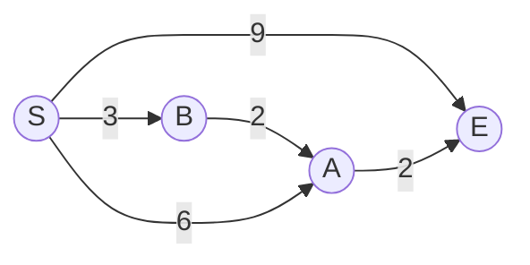
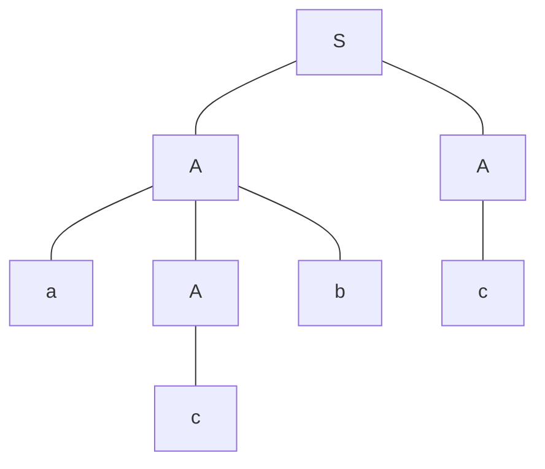

# 2018S1

## Problem 1

Consider the problem of finding the shortest paths in a weighted directed graph using Dijkstra's algorithm. Denote the set of vertices as $V$, the number of vertices as $|V|$, the set of edges as $E$, and the number of edges as $|E|$.

Answer the following questions.

1. Depict an example input data (with $|V| = 3$) for which Dijkstra's algorithm does not correctly find the shortest paths.

2. Below is a pseudo-code of the algorithm that computes the length $c[v]$ of the shortest path from the start node s to each node v. Answer code to fill in the blank $[\quad a \quad]$.

```
Dijkstra( graph G = (V,E), start node s, length d(u,v) of each edge (u,v) ) {
    c = an empty array;    Q = an empty set;
    for ( v ∈ V )
        c[v] = ∞;
    c[s] = 0;
    for ( v ∈ V )
        add v to Q;
    while ( Q ≠ ∅ ) {
        v = a vertex v ∈ Q that minimizes c[v];   ]
        remove v from Q;                          ] . . . . (i)
        for ( u ∈ {destinations of edges outgoing from v} )
            [    a    ]                           ] . . . . (ii)
    }
}
```

3. Consider the following graph with $S$ as the start node. Show how the values stored in the array $c$ change at each iteration of the while statement when the above algorithm is applied to the graph.



4. For each of the code fragments (i) and (ii) in the above pseudo-code, answer the total time spent in the code fragment during the whole run of the algorithm, using big $O$ notation. Here assume that it takes $O(|V|)$ time to execute code fragment (i) once.

5. One can reduce the computational complexity of the algorithm by using a priority queue (binary heap) as $Q$. In that case, for each of the code fragments (i) and (ii) in the above pseudo-code, answer the total time spent in the code fragment during the whole run of the refined algorithm, using big $O$ notation.

---

考虑使用 Dijkstra 算法在加权有向图中寻找最短路径的问题。将顶点集表示为 $V$，顶点数表示为 $|V|$，边集表示为 $E$，边数表示为 $|E|$。

回答以下问题。

1. 描绘一个输入数据示例（$|V| = 3$），使得 Dijkstra 算法无法正确找到最短路径。

2. 下面是计算从起始节点 $s$ 到每个节点 $v$ 的最短路径长度 $c[v]$ 的算法伪代码。回答填写空白处 $[\quad a \quad]$ 的代码。

```
Dijkstra( 图 G = (V,E), 起始节点 s, 每条边 (u,v) 的长度 d(u,v) ) {
    c = 空数组;    Q = 空集合;
    for ( v ∈ V )
        c[v] = ∞;
    c[s] = 0;
    for ( v ∈ V )
        将 v 加入 Q;
    while ( Q ≠ ∅ ) {
        v = Q 中使 c[v] 最小的顶点;               ]
        从 Q 中移除 v;                            ] . . . . (i)
        for ( u ∈ {v 的出边目标节点集} )
            [    a    ]                           ] . . . . (ii)
    }
}
```

3. 考虑以下图，其中 S 为起始节点。展示当上述算法应用于该图时，数组 c 中存储的值在 while 语句的每次迭代中如何变化。


4. 对于上述伪代码中的代码片段 (i) 和 (ii)，使用大 $O$ 表示法回答在算法整个运行过程中在每个代码片段中花费的总时间。这里假设执行代码片段 (i) 一次需要 $O(|V|)$ 时间。

5. 可以通过使用优先队列（二叉堆）作为 $Q$ 来降低算法的计算复杂度。在这种情况下，对于上述伪代码中的代码片段 (i) 和 (ii)，使用大 $O$ 表示法回答在改进后的算法整个运行过程中在每个代码片段中花费的总时间。

---

## Problem 2

For a context-free grammar $G$, we write $\mathcal{L}(G)$ for the language generated by $G$. For a word $w$, we write $|w|$ for its length. We write $\epsilon$ for an empty word. Answer the following questions.

(1) Let $G_0$ be the context-free grammar consisting of the production rules:

$$
S \rightarrow AA \quad A \rightarrow c \quad A \rightarrow aAb
$$

where $S$ is the start symbol. A derivation of $acbc$ in $G_0$ can be represented by the following syntax tree:



Draw a syntax tree that represents a derivation of $aacbbc$ in $G_0$.

(2) For the grammar $G_0$ in question (1), obtain words $u, v, w, x, y \in \{a, b, c\}^*$ that satisfy all of the following three conditions. (i) $uvwxy = acbc$, (ii) $uv^nwx^ny \in \mathcal{L}(G_0)$ for every $n \geq 0$, and (iii) $|vx| > 0$. Here, note that some of $u, v, w, x, y$ may be empty words $\epsilon$.

(3) Prove that, for every context-free grammar $G$, there exists an integer $N$ that satisfies the following property:

For every word $z \in \mathcal{L}(G)$, if $|z| > N$, then there exist words $u, v, w, x, y$ that satisfy all of the following four conditions: (i) $z = uvwxy$, (ii) $uv^nwx^ny \in \mathcal{L}(G)$ for every $n \geq 0$, (iii) $|vx| > 0$, and (iv) $|wvx| \leq N$.

Here, you may assume that $G$ is in Chomsky normal form, i.e., each production rule is one of the forms $A \rightarrow BC$, $A \rightarrow a$, and $S \rightarrow \epsilon$ (where $A$ is a non-terminal symbol, $B$ and $C$ are non-terminal symbols other than $S$, $a$ is a terminal symbol, and $S$ is the start symbol).

(4) Prove that there exists no context-free grammar that generates the language: $\{ ww \mid w \in \{a, b\}^* \}$. You may use the result of question (3) above.

---

对于上下文无关文法 $G$，我们用 $\mathcal{L}(G)$ 表示 $G$ 生成的语言。对于一个单词 $w$，我们用 $|w|$ 表示它的长度。我们用 $\epsilon$ 表示空单词。回答以下问题。

(1) 设 $G_0$ 为包含以下产生式规则的上下文无关文法：

$$
S \rightarrow AA \quad A \rightarrow c \quad A \rightarrow aAb
$$

其中 $S$ 是起始符号。$acbc$ 在 $G_0$ 中的推导可以用以下语法树表示：


绘制一个语法树表示 $aacbbc$ 在 $G_0$ 中的推导。

(2) 对于问题 (1) 中的文法 $G_0$，找出满足以下三个条件的单词 $u, v, w, x, y \in \{a, b, c\}^*$。 (i) $uvwxy = acbc$，(ii) 对于每个 $n \geq 0$，$uv^nwx^ny \in \mathcal{L}(G_0)$，以及 (iii) $|vx| > 0$。这里注意，$u, v, w, x, y$ 中有些可能是空单词 $\epsilon$。

(3) 证明，对于每一个上下文无关文法 $G$，存在一个整数 $N$，使得以下性质成立：

对于每个单词 $z \in \mathcal{L}(G)$，如果 $|z| > N$，那么存在单词 $u, v, w, x, y$，使得以下四个条件全部满足：(i) $z = uvwxy$，(ii) 对于每个 $n \geq 0$，$uv^nwx^ny \in \mathcal{L}(G)$，(iii) $|vx| > 0$，以及 (iv) $|wvx| \leq N$。

这里你可以假设 $G$ 是乔姆斯基范式的，即每个产生式规则的形式为 $A \rightarrow BC$，$A \rightarrow a$，以及 $S \rightarrow \epsilon$（其中 $A$ 是非终结符号，$B$ 和 $C$ 是 $S$ 以外的非终结符号，$a$ 是终结符号，而 $S$ 是起始符号）。

(4) 证明不存在生成语言 $\{ wv \mid w \in \{a, b\}^* \}$ 的上下文无关文法。你可以使用上述问题 (3) 的结果。

---

## Problem 3

In this problem, we construct SRAM with 2-bit address width and 4-bit data width. All symbols for inputs and outputs represent 1-bit signals taking values of 0 or 1. We use memory cells with the following specifications. A memory cell has inputs I, W, and S and an output O, and stores a 1-bit value. At a falling edge of W, the value of I is stored in the memory cell. While S is 1, the stored value is output to O, and otherwise 0 is output to O. In your circuit designs, you can use AND, OR, NOT, and XOR gates in addition to the specified ones. Answer the following questions.

(1) Design a 2-bit decoder. It should have inputs $A_0$ and $A_1$, and outputs $B_0$, $B_1$, $B_2$, and $B_3$. $B_i \ (i = 0, 1, 2, 3)$ outputs 1 if $i = A_0 + 2A_1$, and outputs 0 otherwise.

(2) Let $V_{ij}$ be the memory cell for the $j$-th bit of data stored in address $i \ (i, j = 0, 1, 2, 3)$. Design a circuit to read the stored data, assuming that values are already stored in the memory cells. The circuit has inputs $A_0$ and $A_1$, and outputs $V_0$, $V_1$, $V_2$, and $V_3$. If $A_0 + 2A_1 = i$, then the value stored at $V_{ij}$ is output as $V_j \ (j = 0, 1, 2, 3)$. You can use the decoder designed in question (1).

(3) Add the functionality of storing data to the circuit designed in question (2). Inputs $W_M$, $U_0$, $U_1$, $U_2$, and $U_3$ should be added. At a falling edge of $W_M$, the value of $U_j$ is stored in the memory cell $V_{ij} \ (j = 0, 1, 2, 3)$ for $A_0 + 2A_1 = i$. In this case, the other memory cells keep the stored values. Assume that the values of $A_0$ and $A_1$ are kept unchanged while $W_M$ is 1. You may answer only the differences from your answer to question (2).

---

在这个问题中，我们构建了一个 2 位地址宽度和 4 位数据宽度的 SRAM。所有输入和输出的符号表示 1 位信号，取值为 0 或 1。我们使用的存储单元具有以下规格。一个存储单元有输入 I、W 和 S 以及输出 O，并存储一个 1 位值。在 W 的下降沿时，I 的值存储在存储单元中。当 S 为 1 时，存储的值输出到 O，否则输出 0 到 O。在您的电路设计中，您可以使用 AND、OR、NOT 和 XOR 门以及指定的那些。回答以下问题。

(1) 设计一个 2 位解码器。它应该有输入 $A_0$ 和 $A_1$，输出 $B_0$、$B_1$、$B_2$ 和 $B_3$。当 $i = A_0 + 2A_1$ 时，$B_i \ (i = 0, 1, 2, 3)$ 输出 1，否则输出 0。

(2) 设 $V_{ij}$ 为地址为 $i \ (i, j = 0, 1, 2, 3)$ 存储的数据的第 $j$ 位的存储单元。设计一个电路读取已存储在存储单元中的数据。该电路有输入 $A_0$ 和 $A_1$，输出 $V_0$、$V_1$、$V_2$ 和 $V_3$。如果 $A_0 + 2A_1 = i$，则存储在 $V_{ij}$ 的值作为 $V_j \ (j = 0, 1, 2, 3)$ 输出。您可以使用问题 (1) 中设计的解码器。

(3) 为问题 (2) 中设计的电路增加存储数据的功能。添加输入 $W_M$、$U_0$、$U_1$、$U_2$ 和 $U_3$。在 $W_M$ 的下降沿时，$U_j$ 的值存储在 $V_{ij} \ (j = 0, 1, 2, 3)$ 的存储单元中，对于 $A_0 + 2A_1 = i$。在这种情况下，其他存储单元保持存储的值。假设当 $W_M$ 为 1 时，$A_0$ 和 $A_1$ 的值保持不变。您可以仅回答与问题 (2) 的答案不同之处。
