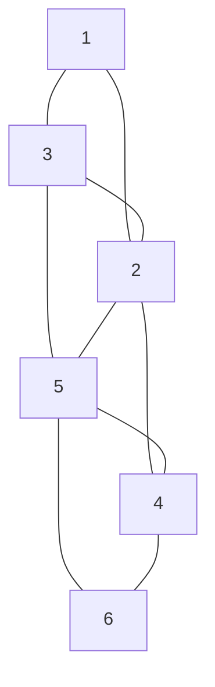
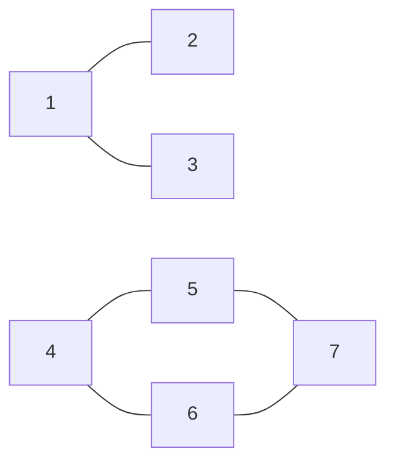

# CBMS-2024A-09

**题目来源**：[[2024A#Question 9]]
**日期**：2024-07-31
**题目主题**：CS-算法-图算法

## Solution

### (1) Write the adjacency list for the given graph



The adjacency list for the given graph is:

$$
\begin{align*}
1: & \ 2, 3 \\
2: & \ 1, 3, 4, 5 \\
3: & \ 1, 2, 5 \\
4: & \ 2, 5, 6 \\
5: & \ 3, 4, 2, 6 \\
6: & \ 5, 4 \\
\end{align*}
$$

### (2) Draw the graph for the given adjacency list

$$
\begin{align*}
1: & \ 2, 3 \\
2: & \ 1 \\
3: & \ 1 \\
4: & \ 5, 6 \\
5: & \ 4, 6, 7 \\
6: & \ 4, 5, 7 \\
7: & \ 5, 6 \\
\end{align*}
$$



### (3) Depth-First Search (DFS) starting from node 2

A possible order to visit the nodes could be:

$$
2 \rightarrow 1 \rightarrow 3 \rightarrow 5 \rightarrow 4
$$

### (4) Breadth-First Search (BFS) starting from node 2

A possible order to visit the nodes could be:

$$
2 \rightarrow 1 \rightarrow 4 \rightarrow 5 \rightarrow 3
$$

### (5) Pseudocode for DFS to Find the Number of Connected Components with Explicit Use of $A_{ij}$

```c
// Algorithm: CountConnectedComponentsDFS
int n; // Number of nodes
int m[n]; // Array storing the number of neighbors for each node
int A[n][max_m]; // Adjacency list representation, max_m is the maximum number of edges
bool visited[n]; // Array to keep track of visited nodes
int component_count = 0; // Counter for connected components

// Function to perform DFS
void DFS(int node) {
    visited[node] = true; // Mark the current node as visited
    for (int j = 0; j < m[node]; j++) {
        int neighbor = A[node][j];
        if (!visited[neighbor]) {
            DFS(neighbor); // Recursively visit the neighbors
        }
    }
}

// Main function to count connected components
int main() {
    // Initialize all nodes as not visited
    for (int i = 0; i < n; i++) {
        visited[i] = false;
    }
    // Iterate through all nodes
    for (int i = 0; i < n; i++) {
        if (!visited[i]) {
            DFS(i); // Start DFS from the unvisited node
            component_count++; // Increment component count
        }
    }
    return component_count; // Return the number of connected components
}
```

### (6) Pseudocode for BFS to Find the Number of Connected Components with Explicit Use of $A_{ij}$

```c
// Algorithm: CountConnectedComponentsBFS
int n; // Number of nodes
int m[n]; // Array storing the number of neighbors for each node
int A[n][max_m]; // Adjacency list representation, max_m is the maximum number of edges
bool visited[n]; // Array to keep track of visited nodes
int component_count = 0; // Counter for connected components

// Function to perform BFS
void BFS(int start_node) {
    queue<int> Q; // Queue for BFS
    Q.push(start_node);
    visited[start_node] = true; // Mark the starting node as visited

    while (!Q.empty()) {
        int node = Q.front();
        Q.pop();
        for (int j = 0; j < m[node]; j++) {
            int neighbor = A[node][j];
            if (!visited[neighbor]) {
                visited[neighbor] = true; // Mark neighbor as visited
                Q.push(neighbor); // Enqueue the neighbor
            }
        }
    }
}

// Main function to count connected components
int main() {
    // Initialize all nodes as not visited
    for (int i = 0; i < n; i++) {
        visited[i] = false;
    }
    // Iterate through all nodes
    for (int i = 0; i < n; i++) {
        if (!visited[i]) {
            BFS(i); // Start BFS from the unvisited node
            component_count++; // Increment component count
        }
    }
    return component_count; // Return the number of connected components
}
```

## 知识点

#DFS #BFS #图算法 #图论 

## 重点词汇

1. Depth-First Search (DFS) 深度优先搜索
2. Breadth-First Search (BFS) 广度优先搜索
3. Adjacency List 邻接表

## 参考资料

1. Introduction to Algorithms, Thomas H. Cormen, Charles E. Leiserson, Ronald L. Rivest, and Clifford Stein, Chap. 22.
2. Graph Theory with Applications, J.A. Bondy and U.S.R. Murty, Chap. 1.
