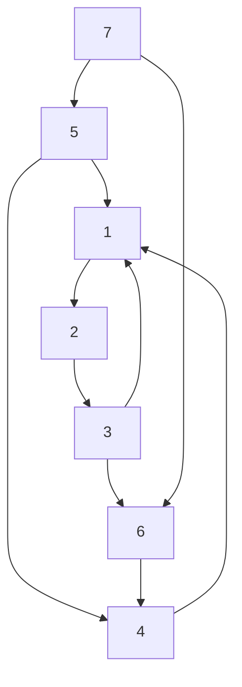

# CBMS-2017-10

**题目来源**：[[文字版题库/CBMS/2017#Question 102017#Question 10]]
**日期**：2024-07-29
**题目主题**：CS-图-最短路径

## Solution

### (1) Directed Graph Analysis

Given the directed graph, we will:

(A) Construct the adjacency matrix.

(B) Construct the shortest distance matrix.

Let's start with the directed graph:



#### (A) Adjacency Matrix

The adjacency matrix $\mathbf{A}$ for the graph is a square matrix where the element $a_{i,j}$ is 1 if there is an edge from vertex $i$ to vertex $j$, and 0 otherwise.

$$
\mathbf{A} = \begin{bmatrix}
0 & 1 & 0 & 0 & 0 & 0 & 0 \\
0 & 0 & 1 & 0 & 0 & 0 & 0 \\
1 & 0 & 0 & 0 & 0 & 1 & 0 \\
1 & 0 & 0 & 0 & 0 & 0 & 0 \\
1 & 0 & 0 & 1 & 0 & 0 & 0 \\
0 & 0 & 0 & 1 & 0 & 0 & 0 \\
0 & 0 & 0 & 0 & 1 & 1 & 0 \\
\end{bmatrix}
$$

#### (B) Shortest Distance Matrix

The matrix $\mathbf{S}$ will be computed using the Floyd-Warshall algorithm. The element $s_{i,j}$ is the shortest distance from vertex $i$ to vertex $j$.

1. Initialize $\mathbf{S}$ with:
    - $s_{i,j} = 0$ if $i = j$
    - $s_{i,j} = 1$ if there is an edge from $i$ to $j$
    - $s_{i,j} = +\infty$ otherwise

2. Update $\mathbf{S}$ using the Floyd-Warshall algorithm:

    $$
    s_{i,j} = \min(s_{i,j}, s_{i,k} + s_{k,j})
    $$

The final $\mathbf{S}$ matrix is:

$$
\mathbf{S} = \begin{bmatrix}
0 & 1 & 2 & 4 & \infty & 3 & \infty \\
2 & 0 & 1 & 3 & \infty & 2 & \infty \\
1 & 2 & 0 & 2 & \infty & 1 & \infty \\
1 & 2 & 3 & 0 & \infty & 4 & \infty \\
1 & 2 & 3 & 1 & 0 & 4 & \infty \\
2 & 3 & 4 & 1 & \infty & 0 & \infty \\
2 & 3 & 4 & 2 & 1 & 1 & 0 \\
\end{bmatrix}
$$

### (2) General Case Analysis

#### (A) Matrix $\mathbf{D^{(1)}}$ in terms of $\mathbf{D^{(0)}}$

The matrix $\mathbf{D^{(1)}}$ is computed by considering paths that may pass through the vertex 1.

$$

d_{i,j}^{(1)} = \min(d_{i,j}^{(0)}, d_{i,1}^{(0)} + d_{1,j}^{(0)})

$$

#### (B) Recursive Calculation

To find $\mathbf{D^{(k+1)}}$ from $\mathbf{D^{(k)}}$, use:

$$

d_{i,j}^{(k+1)} = \min(d_{i,j}^{(k)}, d_{i,k+1}^{(k)} + d_{k+1,j}^{(k)})

$$

#### (C) Algorithm for All-Pair Shortest Paths

The Floyd-Warshall algorithm is suitable for computing all-pair shortest distances:

1. Initialize $\mathbf{D}$ where $d_{i,j}$ is 0 if $i = j$, 1 if there is an edge $i \to j$, and $+\infty$ otherwise.
2. Update $\mathbf{D}$ using:

    $$
    d_{i,j} = \min(d_{i,j}, d_{i,k} + d_{k,j})
    $$

    for all vertices $k$ from 1 to $n$.

**Algorithm:**

```
function FloydWarshall(V, E):
    let D be a |V| x |V| matrix of minimum distances
    for each vertex v in V:
        D[v][v] = 0
    for each edge (u, v) in E:
        D[u][v] = 1
    for each k from 1 to |V|:
        for each i from 1 to |V|:
            for each j from 1 to |V|:
                D[i][j] = min(D[i][j], D[i][k] + D[k][j])
    return D
```

**Time Complexity:**

The time complexity of the Floyd-Warshall algorithm is $O(|V|^3)$ because it involves three nested loops, each running $n$ times.

## 知识点

#最短路径 #Floyd-Warshall算法 #图论

## 重点词汇

- adjacency matrix 邻接矩阵
- shortest distance 最短距离
- edge 边
- vertex 顶点

## 参考资料

1. 《算法导论》 第 25 章 最短路径算法
