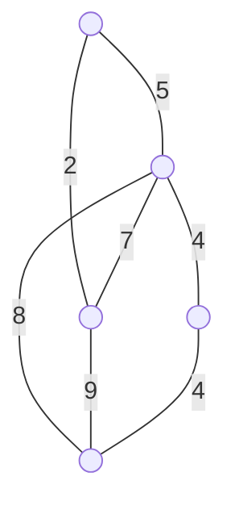

# CBMS-2018-10

**题目来源**：[[文字版题库/CBMS/2018#Question 10|2018#Question 10]]
**日期**：2024-07-27
**题目主题**：CS-图-图论基本性质

## Solution

### Question 1

Prove that the sum of the vertex degrees of an undirected graph is equal to the number of edges times two.

#### Solution

In an undirected graph $\mathbf{G(V, E)}$, each edge $\mathbf{e} \in \mathbf{E}$ connects two vertices, contributing to the degree of both vertices. Therefore, each edge increases the sum of the vertex degrees by 2. Mathematically,

$$
\sum_{v \in \mathbf{V}} \deg(v) = 2 \left| \mathbf{E} \right|
$$

where $\deg(v)$ denotes the degree of vertex $v$, and $\left| \mathbf{E} \right|$ denotes the number of edges. This is known as the Handshaking Lemma.

### Question 2

Prove the following proposition: If a graph $\mathbf{G(V, E)}$ with vertex set $\mathbf{V}$ and edge set $\mathbf{E}$ is a tree, $\left| \mathbf{E} \right| = \left| \mathbf{V} \right| - 1$.

#### Solution

A tree is a connected acyclic graph. For a graph $\mathbf{G(V, E)}$ to be a tree, it must satisfy the following properties:

1. It is connected.
2. It contains no cycles.
3. The number of edges $\left| \mathbf{E} \right| = \left| \mathbf{V} \right| - 1$.

To prove this, we use induction on the number of vertices $\left| \mathbf{V} \right|$.

**Base Case**: For $\left| \mathbf{V} \right| = 1$, there are no edges, so $\left| \mathbf{E} \right| = 0 = 1 - 1$.

**Inductive Step**: Assume the statement is true for a tree with $n$ vertices, i.e., it has $n-1$ edges. Consider adding a new vertex $v$ to the tree. To maintain the tree properties, $v$ must be connected to exactly one existing vertex, adding one new edge. Thus, the new tree has $n+1$ vertices and $n$ edges, maintaining the property $\left| \mathbf{E} \right| = \left| \mathbf{V} \right| - 1$.

Hence, by induction, the proposition is proved.

### Question 3

Given an undirected graph $\mathbf{G(V, E)}$ and a set of edges $\mathbf{T \subseteq E}$, the graph $\mathbf{S(V, T)}$ is called a spanning tree, if $\mathbf{S}$ is a tree. Among all spanning trees of a weighted graph, those with the minimum sum of weights are called minimum spanning trees. Show a minimum spanning tree of the following graph.

#### Solution

To find the minimum spanning tree, we can use Kruskal's algorithm or Prim's algorithm. Here, we will use Kruskal's algorithm.

1. Sort the edges by weight:
   - A-C (2)
   - B-D (4)
   - D-E (4)
   - A-B (5)
   - B-C (7)
   - B-E (8)
   - C-E (9)

2. Select edges in order of weight, ensuring no cycles are formed:
   - A-C (2)
   - B-D (4)
   - D-E (4)
   - A-B (5)

Thus, the minimum spanning tree includes edges A-C, B-D, D-E, and A-B.

### Question 4

Assume that $\mathbf{S(V, T)}$ and $\mathbf{S'(V, T')}$ are different spanning trees of graph $\mathbf{G}$. Prove the following proposition: For any edge $\mathbf{e' \in T' - T}$, there is an edge $\mathbf{e \in T - T'}$ such that $(\mathbf{T - \{e\}}) \cup \{\mathbf{e'}\}$ forms a spanning tree.

#### Solution

Given two different spanning trees $\mathbf{S(V, T)}$ and $\mathbf{S'(V, T')}$ of graph $\mathbf{G}$, and an edge $\mathbf{e' \in T' - T}$, consider adding $\mathbf{e'}$ to $\mathbf{S(V, T)}$. This addition creates exactly one cycle, since $\mathbf{S(V, T)}$ is initially acyclic.

In this cycle, there must be at least one edge $\mathbf{e}$ that is in $\mathbf{T}$ but not in $\mathbf{T'}$ (because if every edge in the cycle were in $\mathbf{T}$, $\mathbf{e'}$ would not be in the cycle). Removing this edge $\mathbf{e}$ from $\mathbf{T}$ breaks the cycle, restoring the tree property.

Therefore, $(\mathbf{T - \{e\}}) \cup \{\mathbf{e'}\}$ forms a spanning tree.

## 知识点

#图论 #最小生成树 #Kruskal算法 #数学归纳法

## 重点词汇

- vertex 顶点
- edge 边
- degree 度
- spanning tree 生成树
- minimum spanning tree 最小生成树
- cycle 环

## 参考资料

1. "Introduction to Graph Theory" by Douglas B. West, Chapter 1
2. "Graph Theory with Applications" by Bondy and Murty, Section 2.1
