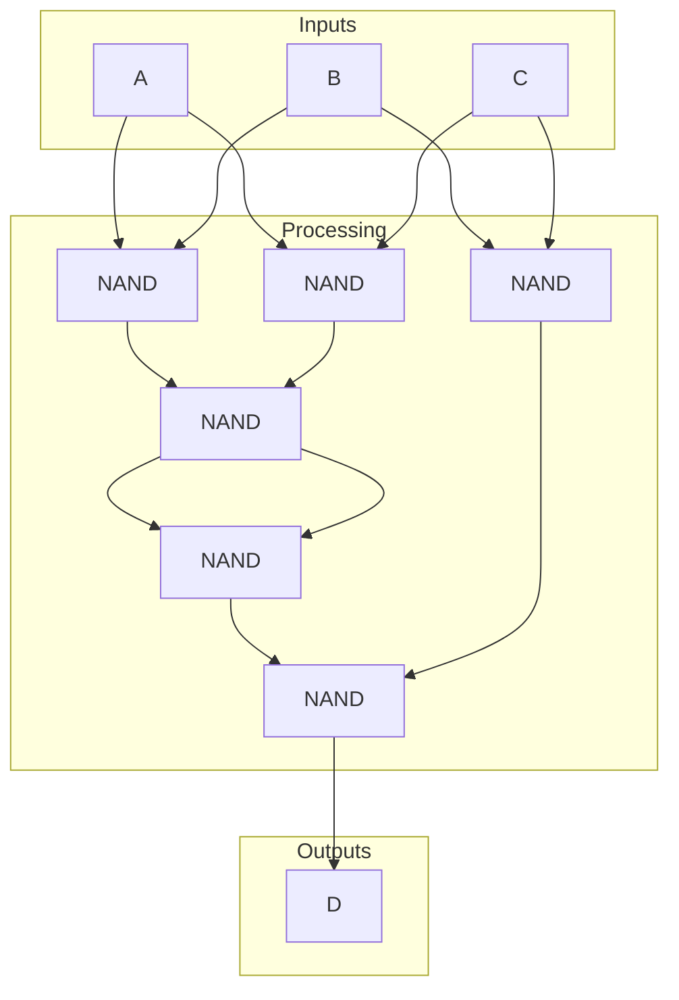
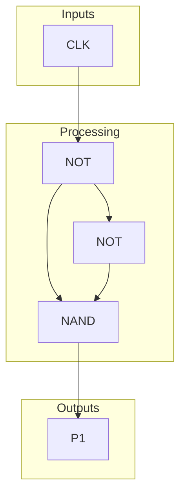
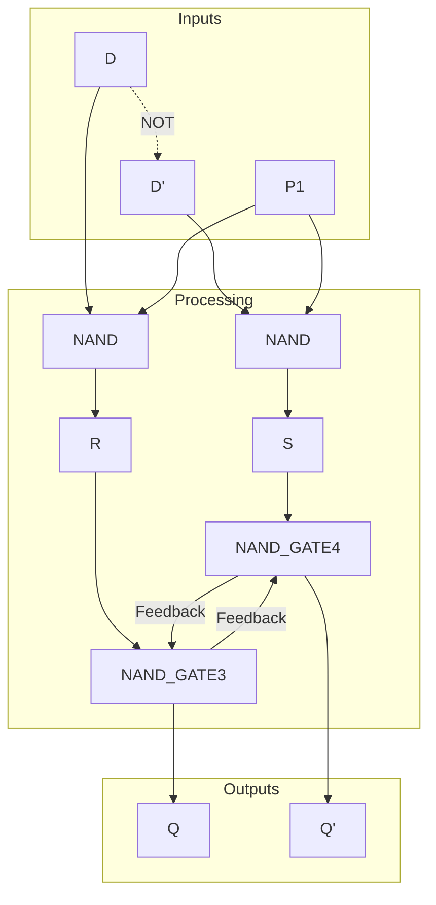
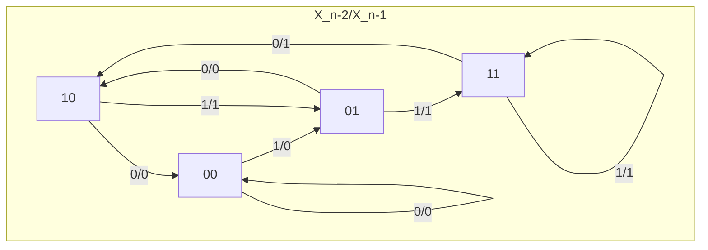
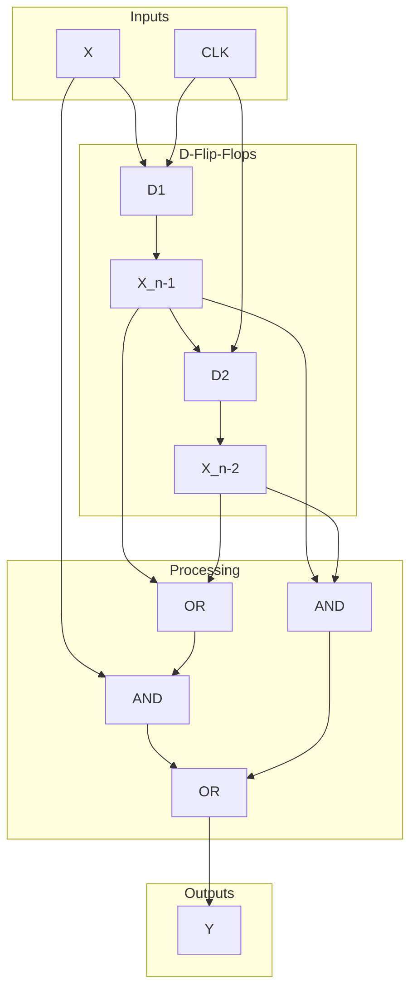

# IS CS-2022W-04

**题目来源**：[[2022W#Problem 4]]
**日期**：2024-07-19
**题目主题**：CS-数字电路-组合逻辑电路和时序电路

## 具体题目

1. Provide a Boolean expression of the output $D$ according to the following truth table. Design and depict a corresponding combinational circuit by using at most six 2-input NAND gates.

   > **Truth table**
>
   > $$

   \begin{array}{|c|c|c|c|}

   \hline

   \text{Input} & & & \text{Output} \\

   \hline

   A & B & C & D \\

   \hline

   0 & 0 & 0 & 0 \\

   0 & 0 & 1 & 0 \\

   0 & 1 & 0 & 0 \\

   0 & 1 & 1 & 1 \\

   1 & 0 & 0 & 0 \\

   1 & 0 & 1 & 1 \\

   1 & 1 & 0 & 1 \\

   1 & 1 & 1 & 1 \\

   \hline

   \end{array}

   $$
2. Depict the internal structure of a D-flip-flop, and explain how the D-flip-flop holds a 1-bit value.

3. Consider a clock-synchronous sequential circuit with a 1-bit input $\mathbf{CLK}$, a 1-bit input $\mathbf{X}$, and a 1-bit output $\mathbf{Y}$, where the input $\mathbf{CLK}$ is used for the clocking. The output $\mathbf{Y}$ is '1' when the number of '1' in the input $\mathbf{X}$ values in the past three clock cycles (excluding the current clock cycle) is greater than the number of '0'. Otherwise, the output $\mathbf{Y}$ is '0'. The output $\mathbf{Y}$ may be any value during the initial three clock cycles after the circuit is powered on. Assume that the circuit satisfies the setup-time and hold-time constraints. Design and depict the circuit. You may use at most two D-flip-flops and an arbitrary number of 2-input AND gates, 2-input OR gates, and NOT gates, if necessary.

## 正确解答

### (1) Boolean Expression and Combinational Circuit

#### Karnaugh Map

The truth table can be represented as a Karnaugh map:

| C\AB | 00 | 01 | 11 | 10 |
|------|----|----|----|----|
| 0    | 0  | 0  | 1  | 0  |
| 1    | 0  | 1  | 1  | 1  |

We can circle the 1s in the Karnaugh map to simplify the expression:

- $AB = 1$ and $C = 0$
- $A + B = 1$ and $C = 1$

#### Simplified Expression

The simplified Boolean expression for the output $D$ is:
$$

D = AB\overline{C} + (A + B)C

= AB\overline{C} + AC + BC = A(B\overline{C} + C) + BC = AB + AC + BC

$$
#### Combinational Circuit using 2-input NAND Gates

NAND: $A \text{ NAND } B = (A \cdot B)'$

Especially, $A \text{ NAND } A = A'$, so we can use the NAND gate to implement the NOT gate.

First, we simplify the expression further:
$$

D = AB + AC + BC = ((AB + AC + BC)')' = ((AB)' \cdot (AC)' \cdot (BC)')' = ((((AB)' \cdot (AC)')')' \cdot (BC)')'

$$

The corresponding combinational circuit using at most six 2-input NAND gates is as follows:



The circuit uses six 2-input NAND gates to implement the simplified expression for $D$.

### (2) D-Flip-Flop Structure and Explanation

#### Internal Structure

A D-flip-flop consists of the following components:

1. **D input**: The input data bit to be input to the flip-flop.
2. **Clock input**: The clock signal that controls the operation of the flip-flop.
3. **Q output**: The output of the flip-flop that stores the value of the D input.
4. **Q' output**: The complement of the Q output.

The output Q table for a D-flip-flop is as follows:

| D | CLK | Q(t) | Q(t+1) |
|---|-----|------|--------|
| 0 | 0   | Q(t) | Q(t)   |
| 1 | 0   | Q(t) | Q(t)   |
| 0 | ↑   | Q(t) | 0      |
| 1 | ↑   | Q(t) | 1      |
| 0 | 1   | Q(t) | Q(t)   |
| 1 | 1   | Q(t) | Q(t)   |
| 0 | ↓   | Q(t) | Q(t)   |
| 1 | ↓   | Q(t) | Q(t)   |

To detect the rising edge of the clock signal, first, we need to build a circuit, using the delay of the signal to detect the rising edge. The circuit is called a "master-slave D flip-flop."

```plaintext
              /-------------\
CLK----NOT----               NAND----P_1
              \-----NOT-----/
```



This circuit uses two NOT gates and a NAND gate to detect the rising edge of the clock signa because the NOT gate introduces a delay in the signal.

With the signal $P_1$, we can build the master-slave D flip-flop:



The master-slave D flip-flop uses two NAND gates to store the value of the D input based on the rising edge of the clock signal.

#### Explanation

The D-flip-flop holds a 1-bit value by using the clock signal to control the transfer of the input data to the output. For example, suppose the input data is '1' and the clock signal has a rising edge. In that case, the P1 signal will be '1' for a short period, allowing the input data to be transferred to the output, which will then store the value '1' no matter how the input data changes after the rising edge of the clock signal. It is the same for the input data '0'. The D-flip-flop holds the value of the input data until the next rising edge of the clock signal.

### (3) Clock-Synchronous Sequential Circuit

Input: CLK, X
Output: Y

Let $X_n$ denote the value of input $X$ at clock cycle $n$. Using D-flip-flops, we can easily obtain the values of $X_{n-1}$ and $X_{n-2}$.

The output $Y$ is '1' when the number of '1's in the input $X$ values in the past three clock cycles (excluding the current clock cycle) is greater than the number of '0's. Otherwise, the output $Y$ is '0'.

#### State Diagram

The state diagram for the $X_{n-1}$ and $X_{n-2}$ values with the current clock cycle input and output $X_n/Y$ is as follows:



#### Truth Table

The truth table for the output $Y$ based on the values of $X_{n-1}$ and $X_{n-2}$ is as follows:

|X_n\X_{n-1}X_{n-2}|00|01|11|10|
|---|---|---|---|---|
|0  |0  |0  |1  |0  |
|1  |0  |1  |1  |1  |

#### Simplified Expression

$Y = X_{n-1}X_{n-2} + X_{n-1}X_n + X_{n-2}X_n$

#### Combinational Circuit

Based on the answer of (1) and (2), we can design the combinational circuit for the output $Y$ using the D-flip-flops and the corresponding logic gates.



## 知识点

#布尔代数 #逻辑电路 #D触发器

## 难点解题思路

对于第（3）问，考生需要理解D触发器的工作原理以及如何使用组合逻辑电路进行计数和比较。这需要扎实的时序电路基础和布尔代数知识。

## 解题技巧和信息

在解答涉及时序电路的题目时，先画出状态图或状态表，明确各个状态之间的转换关系。然后，根据状态图设计出D触发器的连接方式和所需的逻辑门。

## 重点词汇

- **Boolean expression** 布尔表达式
- **NAND gate** 与非门
- **D-flip-flop** D触发器
- **Clock signal** 时钟信号
- **Sequential circuit** 时序电路

## 参考资料

1. "Digital Design" by M. Morris Mano, Chap. 5
2. "Fundamentals of Logic Design" by Charles H. Roth, Chap. 7
